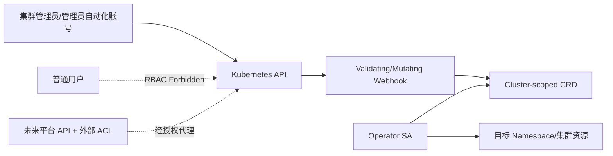

# 容器平台备份与恢复插件需求规格说明书

> 文档版本：V1.0-draft  
> 评审用途：产品需求评审、架构评审、研发排期  
> API 基线：`protection.platform.io/v1alpha1`  
> 更新日期：2026-07-13

## 1. 文档概述

### 1.1 文档目的

定义一套由 Kubernetes Operator 驱动的容器平台备份与恢复插件。当前仓库发行物面向单个 Kubernetes 集群，由集群管理员通过 Kubernetes API/CRD 操作；本文同时保留未来平台 API 与 Web 控制台的接口草案。本文给出可实现、可测试、可追踪的业务边界、权限、需求、质量指标与版本计划；CRD、控制器、页面、流程、API 和测试细节分别见同目录其他文档。

### 1.2 项目背景与问题

现有平台缺少统一的 Kubernetes 资源及 PVC 数据保护能力，升级、发布、误操作与存储故障前后依赖人工导出 YAML，存在范围不准确、凭据泄露、任务不可观测、快照与记录失联和恢复顺序错误等风险。本插件以备份策略统一承载选择范围、调度和保留配置，并将备份目的地、单次执行、可恢复副本和恢复执行建模为职责明确的集群级对象。

### 1.3 产品目标

1. 在单集群内提供 Local、SFTP 仓库，Kubernetes 资源归档与 CSI PVC 快照。
2. 支持 Cluster、多 Namespace、资源类型、标签、include/exclude 的可预览范围。
3. 支持可审计的 Cron 与手动任务，具备防重、补偿、取消、超时、重试和部分失败表达。
4. 仅在包上传完整且校验通过后生成 `Available` 的 `BackupRecord`。
5. 支持原位/新 Namespace/Namespace 映射恢复、选择性恢复、PVC 恢复和冲突策略。
6. 明确当前版本的管理员安全边界：仅集群管理员和 Operator ServiceAccount 可访问 Cluster-scoped CRD，普通用户不得直接访问。

### 1.4 产品范围

V1.0 包含：Local（hostPath、固定节点、PVC 挂载）、SFTP、资源 YAML 归档、CSI `snapshot.storage.k8s.io/v1` 快照、Cron、手动任务、记录完整性校验、同集群恢复、日志/事件/指标、基础通知与保留回收。

### 1.5 非目标范围

- V1.0 不承诺跨集群、跨 CSI 驱动或跨存储厂商恢复快照。
- 不提供应用数据逻辑备份（如 `mysqldump`）和文件级 PVC 数据搬运；Hook 仅保留 schema。
- 不提供 S3/OBS/MinIO、磁带、仓库复制与迁移执行能力。
- 不备份 etcd 二进制数据，不替代控制平面/etcd 灾备。
- 不恢复 Node、Lease、Event、EndpointSlice 等瞬态/运行时对象。
- 当前发行物不提供多租户、项目级数据可见性或 Namespace 行级授权；`includeNamespaces` 仅表示备份选择范围，不能作为授权依据。
- 不保证恶意集群管理员不可读取集群中的 Secret；备份包加密不等同于对集群管理员的安全隔离。

### 1.6 名词解释

| 名词 | 定义 |
|---|---|
| Repo | `BackupRepository`，副本包存储目的地；PVC 快照本体仍由 CSI 后端持有 |
| Selection | `BackupPolicy.spec.selection`，资源选择、清洗和 PVC 快照规则 |
| Policy | `BackupPolicy`，内嵌 Selection，并定义 Repo、调度、保留和执行默认值 |
| Task | `BackupTask`/`RestoreTask`，一次异步执行及状态机 |
| Record | `BackupRecord`，完成副本的不可变索引与生命周期对象 |
| Package | Repo 中的资源归档、索引、日志、快照引用及校验文件 |
| Snapshot | CSI `VolumeSnapshot`/`VolumeSnapshotContent` 与存储后端快照 |
| 原位恢复 | 恢复到原集群、原 Namespace |
| CrashConsistent | 不冻结应用，仅以存储快照点保证崩溃一致性 |
| AppConsistent | 通过 Hook/应用协议使数据落盘后快照；V1.1 实现 |
| RPO/RTO | 可容忍的数据丢失时间 / 服务恢复时间目标 |

### 1.7 参考资料与 Velero 对比

官方参考：

- [Velero v1.18 Backup API](https://velero.io/docs/v1.18/api-types/backup/)
- [Velero v1.18 Restore API](https://velero.io/docs/v1.18/api-types/restore/)
- [Velero v1.18 BackupStorageLocation](https://velero.io/docs/v1.18/api-types/backupstoragelocation/)
- [Velero v1.18 Resource Filtering](https://velero.io/docs/v1.18/resource-filtering/)
- [Velero v1.18 CSI Support](https://velero.io/docs/v1.18/csi/)
- [Velero v1.18 Backup Hooks](https://velero.io/docs/v1.18/backup-hooks/)
- [Kubernetes Operator Pattern](https://kubernetes.io/docs/concepts/extend-kubernetes/operator/)
- [Kubernetes Volume Snapshots](https://kubernetes.io/docs/concepts/storage/volume-snapshots/)
- [Kubernetes VolumeSnapshotClass](https://kubernetes.io/docs/concepts/storage/volume-snapshot-classes/)
- [Kubernetes CronJob](https://kubernetes.io/docs/concepts/workloads/controllers/cron-jobs/)
- [Kubernetes RBAC](https://kubernetes.io/docs/reference/access-authn-authz/rbac/)
- [Kubernetes Dynamic Admission Control](https://kubernetes.io/docs/reference/access-authn-authz/extensible-admission-controllers/)

| 比较项 | Velero 成熟思想 | 本平台设计 | 差异原因/影响 |
|---|---|---|---|
| 存储位置 | `BackupStorageLocation` 面向对象存储 provider/bucket/prefix，凭据通常在 Velero Namespace | `BackupRepository` 原生支持 Local/SFTP，包含挂载、节点约束、known_hosts、健康、容量、加密、原子提交约束 | 第一阶段适配私有化基础设施；Adapter 接口为对象存储预留 |
| 备份对象 | `Backup` 同时是执行请求、状态和可恢复备份身份 | `BackupTask` 表示执行；`BackupRecord` 表示完成副本 | 允许任务清理而记录长期保留；失败任务不会伪装成副本；记录可独立校验/过期/损坏 |
| 恢复对象 | `Restore` 由 Backup/Schedule 来源，支持 namespaceMapping 与资源过滤 | `RestoreTask` 只能引用明确 `BackupRecord`，增加 DryRun/计划、预检查、逐类冲突策略和目标集群校验 | 避免“最新一次”漂移，提高审计和确定性 |
| 作用域 | Velero 核心运行对象通常位于 Velero Namespace | 六个核心对象均为 Cluster-scoped | 支持整集群/多 Namespace；不受业务 Namespace 删除影响；恢复可创建 Namespace/集群资源。代价是原生 RBAC 无法做对象级行过滤，当前仅允许管理员使用 |
| 过滤 | `included/excludedNamespaces/resources`、label selector、`includeClusterResources` | 一一映射到 `BackupPolicy.spec.selection`；额外提供 cluster-scoped 过滤、Secret/CRD/CR 开关、PVC 过滤和预览 | 将备份内容、目的地和调度作为一个策略管理；Task 固化 Selection 快照避免运行中漂移 |
| Hook | Pre/Post exec Hook | V1.0 schema 预留、拒绝启用；V1.1 支持 AppConsistent 与失败策略 | Hook 需要高权限 exec、安全审计和解冻兜底，不进入 MVP |
| VolumeSnapshot | CSI/Provider snapshot | V1.0 仅 CSI v1、同集群恢复 | 快照通常是后端引用，不天然可移植 |
| 文件备份 | Node Agent/FSB | V2.0 文件级数据备份 | 需要特权 DaemonSet、数据移动、增量链、限流和恢复编排，MVP 风险过高 |

### 1.8 架构原则的合理性与影响

- Cluster-scoped 保证统一运维和历史独立性，但 Kubernetes 原生 RBAC 无法按 CR spec 做对象级行授权。当前发行物采用单集群管理员/单租户模式，普通用户不得直接 get/list/watch/create/update/delete 这些 CRD。
- 未来若提供多租户能力，必须由平台外部 ACL/API 维护主体到对象与 Namespace 的授权关系，并在备份、预览和恢复执行时重新校验 Namespace 权限；不能把 `includeNamespaces` 当作权限证明。
- `Task` 与 `Record` 分离后有两个生命周期：任务是执行审计，记录是资产；删除关系默认非级联。
- Secret 使用显式 namespace/name/key，便于跨 Namespace 引用的授权与审计；Webhook 仅允许配置的 Secret Namespace，控制器按最小权限读取。
- 所有外部副作用以 finalizer、确定性名称和 checkpoint 驱动；“至少一次 Reconcile + 幂等动作”优于假设精确一次。
- 定时调度与 Kubernetes CronJob 一样不能依赖“绝不重复”，因此以 `policyUID/scheduledTime` 唯一键创建 Task。

### 1.9 假设、约束与待确认项

| 编号 | 假设/约束 | 处理 |
|---|---|---|
| A-01 | API group 暂用 `protection.platform.io/v1alpha1` | 代码生成前替换为企业域名；对象 kind 不变 |
| A-02 | 当前发行物仅由单集群管理员使用，不依赖平台身份目录 | 对普通用户开放前必须新增平台外部 ACL/API、审计和 Namespace 执行时复验；该能力不属于当前 MVP |
| A-03 | Operator 与目标工作负载位于同一集群 | 多集群由每集群 agent + 中心控制面在 V2.0 实现 |
| A-04 | Kubernetes 首批认证 1.28–1.34，CSI Snapshot API `v1` | 发布前按客户发行版完成矩阵；非矩阵版本阻止安装或标记未认证 |
| A-05 | Cron 为标准 5 字段，不接受秒字段；timezone 为 IANA 名称 | `schedule` 内禁止 `TZ=`/`CRON_TZ=`，避免双重时区 |
| A-06 | V1.0 Local PVC 仅支持 RWO 单执行器或 RWX 多执行器 | 运行前校验 AccessMode 和调度位置 |
| A-07 | SFTP 服务端支持同目录 rename；否则用 `.done` 作为唯一提交标记 | 连通性测试记录 `atomicRenameSupported` |
| A-08 | 备份 Secret 默认关闭；开启需管理员确认和加密 Repo | 集群管理员可配置是否强制加密 |
| A-09 | Rename 仅适用于可安全改名且引用可重写的资源；PVC、Namespace、CRD 默认不允许 | 预检查给出不可执行冲突而不是静默更名 |
| A-10 | `Overwrite` 是 delete/recreate 或 update 的受控组合，不是无条件替换 | 不可变字段冲突需显式允许重建，PVC 默认禁止 |
| A-11 | 保留数量和时间采用“任一满足删除条件”：超过 `maxRecords` 的最旧记录，或年龄超过 `maxAge`；仍受 `minRecords/protect` 保护；详见策略文档 | 产品评审确认是否改为“双条件同时满足” |
| A-12 | 删除记录的三种模式都需二次确认；仅删 CR 会产生可扫描的孤儿包 | V1.0 不自动导入孤儿包，仅在 GC 报告 |

## 2. 业务场景

### 2.1 场景总表

| 场景 | 参与角色 | 前置条件 | 触发条件 | 主流程 | 异常流程 | 结果 | 业务价值 |
|---|---|---|---|---|---|---|---|
| SC-01 集群升级前备份 | 平台/集群管理员 | 健康 Repo、Cluster Scope、快照能力已预检 | 升级变更单获批 | 立即执行策略→采集集群资源→PVC 快照→上传→校验→冻结 Record ID 到变更单 | Repo 容量不足则禁止升级；部分快照失败按策略使任务部分失败/失败 | 获得升级回退点 | 降低控制面和全局配置变更风险 |
| SC-02 应用发布前备份 | 集群管理员/管理员维护的发布系统 | Scope 仅含本次发布需要保护的 Namespace | 发布流水线前置步骤 | 创建手动备份→等待 Record Available→继续发布 | 超时/失败阻断发布；范围包含非预期 Namespace 时由管理员修正 | 应用元数据和 PVC 快照回退点 | 将保护纳入发布门禁 |
| SC-03 Namespace 误删除恢复 | 集群管理员 | Record 独立存在且可访问 | Namespace 被误删 | 选 Record→原名或新 Namespace→预检查→恢复 Namespace/PVC/资源→校验 | Namespace 名被占用、配额不足、Webhook 拒绝则部分失败并列明对象 | Namespace 重建，Record 保持不变 | 缩短人为误删 RTO |
| SC-04 配置对象误修改恢复 | 集群管理员 | 可用 Record、选择性恢复权限 | ConfigMap/Secret/Deployment 配置错误 | 仅选目标 GVR/对象→Diff→Skip/Overwrite→恢复 | 不可变字段提示重建；Secret 恢复需额外确认 | 指定配置回滚 | 避免整应用回滚 |
| SC-05 PVC 数据故障恢复 | 集群管理员 | CSI 快照存在、同集群同驱动可用 | PVC 数据损坏 | 选择 PVC→映射 StorageClass（V1.0 仅相同/兼容）→从 VolumeSnapshot 创建新 PVC→恢复 Workload | 快照丢失、跨 Namespace dataSource 限制、容量/AccessMode 不兼容则阻断 | 新 PVC 绑定并被工作负载引用或原名重建 | 数据面快速回退 |
| SC-06 集群级资源恢复 | 平台/集群管理员 | Cluster Scope Record、集群级恢复权限 | CRD/RBAC/StorageClass 误操作 | DryRun/预检查→CRD→集群依赖→命名空间资源 | CRD conversion webhook 不可用、集群版本不兼容则停止相关 CR | 集群依赖按序恢复 | 保护全局平台配置 |
| SC-07 定时灾备 | 管理员 | 策略启用、Cron/timezone 合法 | 到达 scheduledTime | PolicyController 防重生成 Task→执行→保留回收 | 控制器停机按 missedRunPolicy 补偿；并发按 Allow/Forbid/Replace | 连续副本序列及告警 | 达成 RPO、减少人工操作 |
| SC-08 手动应急备份 | 有 manual 权限用户 | Policy/Repo 可用 | 紧急变更或事故前 | 选择策略→确认→Task，Controller 固化 selection/repository | 重复提交以 idempotencyKey 返回同一 Task | 独立可审计 Task/Record | 快速建立保护点 |
| SC-09 恢复演练 | 平台/集群管理员 | 隔离 Namespace、配额和 Record | 周期演练 | 新 Namespace 映射→预检→恢复→验证→输出演练报告→清理目标资源 | 与生产对象冲突时 Fail；验证不通过记部分失败 | 得到 RTO/可恢复性证据 | 防止“有备份不可恢复” |
| SC-10 Repo 故障与迁移 | 集群管理员 | 至少一个异常 Repo | 健康检查失败/存储迁移 | 停用相关策略或切换新 Repo；旧 Repo 只读；V1.0 导出清单、人工迁移后重新校验 | 旧 Repo 不可访问时 Record=RepoUnavailable；禁止从其恢复 | 新备份写入新 Repo，历史记录可追踪 | 降低存储故障扩散 |

### 2.2 场景规则

1. 任何恢复均不直接从目录路径发起，只能引用 `BackupRecord.metadata.name + UID`。
2. 任何发布门禁只能把 `BackupRecord.status.availability=Available` 作为成功，不以 `BackupTask=Completed` 单独判定。
3. `includeNamespaces`、标签和资源过滤仅定义数据选择范围，不授予调用者任何 Kubernetes 权限；当前版本只接受集群管理员操作。
4. Repo 故障切换仅影响新 Task；已创建 Task 固化的 `repositorySnapshot` 不热切换，避免半包分布到两个 Repo。

## 3. 用户与权限模型

### 3.1 角色定义与数据可见性

| 角色 | 数据可见范围 | 说明 |
|---|---|---|
| 集群管理员 | 当前 `clusterRef` 下全部对象及全局设置 | 当前发行物唯一受支持的人类操作角色；可管理 Repo/Policy/Task/Record/Restore |
| 管理员自动化账号 | 与集群管理员相同，权限由管理员显式授予 | 用于发布流水线或运维自动化；凭据必须独立、可轮换、可审计，不向普通业务用户分发 |
| 普通用户/只读用户 | 无 CRD 数据可见范围 | 不授予 Cluster-scoped CRD 的直接 get/list/watch 或写权限；当前版本也不提供面向该角色的过滤代理 API |
| Operator ServiceAccount | 控制器所需 Kubernetes 资源与指定 Secret Namespace | 不映射终端用户身份；仅供 Operator Pod 使用，不得允许用户模拟该账号 |

### 3.2 权限矩阵

| 资源/操作 | 集群管理员 | 管理员自动化账号 | 普通用户/只读用户 | Operator SA |
|---|---:|---:|---:|---:|
| Repo 查看/测试 | 是 | 显式授权后是 | 否 | 执行所需 |
| Repo 创建/编辑/删除 | 是 | 默认否 | 否 | Reconcile 所需 |
| Cluster/Namespace Scope | 管理 | 显式授权后管理 | 否 | Reconcile 所需 |
| Policy 创建/编辑/启停 | 管理 | 显式授权后管理 | 否 | Reconcile 所需 |
| 立即/手动备份 | 是 | 显式授权后是 | 否 | 执行 |
| Task/Record/日志查看 | 本集群全部 | 显式授权后全部 | 否 | 执行与状态更新 |
| Task 取消/重试 | 是 | 显式授权后是 | 否 | 执行取消请求 |
| Record 校验/删除 | 是；删除需二次确认 | 默认否 | 否 | 校验与 finalizer 清理 |
| Namespace/集群资源恢复 | 是；高危操作二次确认 | 默认否 | 否 | 执行已接受任务 |
| 全局设置 | 管理 | 否 | 否 | 读取并应用 |

### 3.3 Cluster-scoped CRD 访问边界

- 所有业务对象保留不可变的 `spec.clusterRef`，用于单集群控制器路由和关联对象同集群校验；它不是终端用户授权字段。
- 普通用户不绑定这些 CRD 的任何 cluster-wide 读写权限；当前版本不存在可向普通用户安全提供对象级过滤的内置 API。
- `includeNamespaces`、`excludeNamespaces` 和 Namespace 映射是执行参数，不是访问控制。Operator 在当前模式下以自身高权限账号执行，等同于管理员操作。
- 未来平台 API 必须使用外部 ACL 将登录主体绑定到可见 CR UID、允许操作和 Namespace 集合；创建、预览、备份和恢复每次执行前均需按当前 ACL/SubjectAccessReview 复验，撤权后不得仅依赖任务中的旧快照继续执行。
- UI 隐藏和客户端过滤都不是安全边界；未来代理层还必须阻断对象存在性、日志和计数侧信道。

### 3.4 平台 API、RBAC 与 Webhook 边界

| 层 | 职责 | 不承担 |
|---|---|---|
| Kubernetes RBAC | 当前仅向集群管理员、受控自动化账号和 Operator SA 授权；普通用户无 CRD 权限 | 不能按 Cluster-scoped CR 的任意 spec/label 做对象级行授权 |
| Admission Webhook | 跨字段校验、引用约束、Secret namespace 白名单、不可变与删除保护 | 不能拦截 read/list/watch，不能识别 `includeNamespaces` 是否属于某个普通用户 |
| Controller | 执行时再次校验引用 UID、`clusterRef`、范围合法性与存储/CSI 能力 | 当前没有终端用户 ACL 上下文，不能提供 Namespace 权限隔离 |
| 未来平台 API/ACL | 登录身份、对象可见性、操作授权、Namespace 权限复验、幂等、二次确认、审计与脱敏 | 尚未包含在当前仓库发行物中；不能只依赖 UI 或 CR 字段自报身份 |

### 3.5 Admission Webhook 规则

1. 所有核心对象必须 Cluster scope，拒绝 `metadata.namespace`。
2. `clusterRef` 必填、符合平台集群 ID 规则且创建后不可变；Repo、Policy、Task、Record、Restore 的关联引用必须属于同一 `clusterRef`。
3. Policy selection 为 Namespace 时 include 必须非空，exclude 不能与 include 冲突；该校验只保证选择规则有效，不代表调用者获得这些 Namespace 的权限。
4. `includeSecrets/includeCRDs/includeCustomResources` 属于管理员高风险开关；备份 Secret 时 Repo 必须启用包加密。
5. Secret 引用 namespace 必须在 `BackupPluginConfig.spec.security.allowedSecretNamespaces`，默认仅 `backup-system`；禁止同字段内嵌凭据。
6. Repo 被启用 Policy 引用时拒绝删除；Repo 有 Record 时默认拒绝删除，须停用且显式 `force-orphan-records=true` 平台审批。
7. 任务 spec 在创建后不可变，仅允许写 `spec.cancelRequested`；重试创建新 Task，不复用旧 Task。
8. `BackupRecord.spec` 全部不可变，仅 Controller SA 可创建；用户只能请求 verify/delete action，不能伪造 `Available`。
9. Restore 引用 Record UID，Record 必须非 Deleting/Expired/Broken；目标必须为同一 `clusterRef`，当前仅集群管理员可提交恢复。
10. 删除 Record 必须由集群管理员显式写入确认 annotation 和 deletion mode；Webhook 校验字段完整性。未来代理 API 应增加短期签名令牌，当前版本不得宣称已实现该能力。
11. Policy Cron 为 5 字段、timezone 为 IANA 名称；`suspend=true` 或 `enabled=false` 均不得生成 Task。
12. `Overwrite` 对 CRD、Namespace、PVC、PV、StorageClass 等高危资源需 `allowRecreate=true`、管理员权限和二次确认。

## 4. 功能需求

> 每条需求的详细字段落在相应设计文档；本节是排期与验收主索引。P0=上线阻断，P1=应当具备，P2=增强。

| 编号/名称 | 描述与角色 | 前置/输入 | 处理规则 | 输出 | 异常/权限 | 验收标准 | 优先级/版本 |
|---|---|---|---|---|---|---|---|
| BR-REPO-001 创建 Local Repo | 管理员配置 hostPath/节点或 PVC 挂载 | clusterRef、mode、path/claim、Secret(可选) | 路径绝对且非根；探测 RW/容量/权限；hostPath 固定节点 | Repo Ready/Degraded/Unavailable 与容量 | 漂移、只读、低容量报统一错误；repo.manage | 可写文件原子提交并清理；状态含探测时间 | P0/V1.0 |
| BR-REPO-002 创建 SFTP Repo | 管理员配置远端仓库 | host/port/basePath/auth/knownHosts | 强制 host-key 验证；临时上传后 rename 或 `.done`；连接池限流 | 健康、容量（若服务支持）、能力标志 | 认证/host key/超时分类；repo.manage | 错误凭据不可 Ready，日志无密钥 | P0/V1.0 |
| BR-REPO-003 Repo 生命周期 | 测试、停用、编辑、删除 | Repo 已存在 | 凭据/超时热更新；type/path/cluster 不可变；引用保护 | Conditions、审计、删除结果 | 被 Policy/Record 引用时阻止或受控孤儿化 | 三种引用关系均按规则处理 | P0/V1.0 |
| BR-POLICY-001 创建/编辑保护策略 | 管理员配置 Selection/Repo/Cron/retention | 集群资源发现、Repo | 校验内嵌选择规则和 Repo UID；计算预览与 nextRun；修改只影响新 Task | Policy Ready/Paused、selectionPreview、nextRunTime | 空范围、无效 GVR/cron/timezone/ref 拒绝 | 到点生成固化 Selection 的独立 Task | P0/V1.0 |
| BR-POLICY-004 PVC 与范围预检 | 选择 Namespace/GVR/PVC/SnapshotClass | CSI v1 CRD/controller/driver | discovery + 分页 list；校验 SC→CSI driver→VSC 匹配 | Policy selectionPreview 的资源/PVC/Namespace 数和风险 | API 限流或不支持错误可定位 | 预览与 Task 的 selection hash 一致 | P0/V1.0 |
| BR-POLICY-002 并发/错过补偿 | 定义 Allow/Forbid/Replace、Skip/RunOnce/RunAll | scheduledTime、活动 Task | `policyUID/scheduledTime` 防重；补偿窗口/上限 | Task 或 skippedRun 记录 | Replace 先请求取消，超时不启动新任务 | 重启不重复，同 key 只有一个 Task | P0/V1.0 |
| BR-POLICY-003 启停/立即执行/复制 | 管理员管理策略 | enabled/suspend/action | 停用不取消活动 Task；立即执行新建 Manual Task；复制生成禁用草稿 | 新 Policy/Task | 权限/引用健康校验 | 删除 Policy 不删历史 Task/Record | P0/V1.0 |
| BR-TASK-001 手动/定时备份 | 集群管理员或 Policy 发起一次执行 | Policy 来源：policyRef；OneTime 来源：完整 backupSpec | Policy 任务解析并固化配置；OneTime 任务直接执行内联配置，均进入同一状态机 | Task、进度、步骤、事件 | 校验/容量/快照/上传失败分类 | 两种来源完成后都生成独立 Record，OneTime 无 policyRef | P0/V1.0 |
| BR-TASK-002 取消/超时/重试 | 用户控制活动或失败任务 | task UID、原因、idempotencyKey | 安全点取消；超时等同取消后失败；重试创建 trigger=Retry 新 Task | Cancelled/新 Task | Packaging/提交后按补偿清理；权限控制 | 重试不修改旧 Task；重试链可查 | P0/V1.0 |
| BR-TASK-003 进度/日志 | 查看步骤、计数、大小、错误 | Task | status 低频节流；详细日志外置 Repo/日志系统 | phase、conditions、progress、log URL/token | 敏感字段脱敏，超大错误截断 | UI 5 秒轮询/Watch 可见步骤 | P0/V1.0 |
| BR-RECORD-001 生成副本记录 | Controller 从成功 Task 创建 Record | `.done`、manifest、checksum、快照结果 | 先验证再以确定名称创建；spec 不可变 | Available/部分数据标志 | 上传未完成不得 Available | 中断上传无可用 Record | P0/V1.0 |
| BR-RECORD-002 完整性校验 | 管理员/定时控制器校验 | Record、Repo | 校验 `.done`、index、大小、SHA-256、快照存在性 | Available/Broken/SnapshotMissing/RepoUnavailable | 网络失败不误判 Broken | 篡改归档后变 Broken 且禁止恢复 | P0/V1.0 |
| BR-RECORD-003 保留/删除 | 按 count/age 或人工删除 | deletionMode、确认 token | 三模式：CROnly、Data、DataAndSnapshots；finalizer checkpoint | Deleting→删除/失败 | 二次确认；Repo 不可用保留 finalizer | Policy 删除不触发记录删除 | P0/V1.0 |
| BR-RESTORE-001 恢复计划/预检 | 集群管理员选择 Record 和目标 | namespaceMap、resources、PVC、conflict | 下载索引不落资源；同集群、版本、配额、SC、Webhook、冲突检查 | Plan 摘要、blocking/warning、planHash | Record 不可用或目标不兼容时阻断 | 无通过预检的 planHash 不可提交 | P0/V1.0 |
| BR-RESTORE-002 资源恢复 | 按依赖顺序恢复元数据 | 计划、冲突策略 | 清洗 runtime 字段；Skip/Overwrite/Rename/Fail；对象级 checkpoint | RestoreTask 和逐类计数 | 部分失败可继续的资源单独记录 | 原位/新 Namespace 均可完成 | P0/V1.0 |
| BR-RESTORE-003 PVC 恢复 | 从同集群 CSI 快照恢复 | snapshot、PVC 模板、SC | 先创建目标 Namespace/VolumeSnapshot（必要时静态引用）再 PVC | Bound PVC 与映射 | snapshotHandle 缺失/跨集群阻断 | PVC Ready 后才恢复依赖 Workload | P0/V1.0 |
| BR-RESTORE-004 DryRun/选择性恢复 | 预览 Diff、选择 GVR/对象 | Record index 和过滤 | V1.0 预检查为非持久化 DryRun；完整 server-side dry-run V1.1 | Diff/计划 | CRD schema 不兼容标阻断 | V1.1 可不创建任何目标资源完成演练 | P1/V1.1 |
| BR-RESTORE-005 取消/超时/失败重试 | 用户控制活动或失败恢复 | RestoreTask UID、原因、幂等键 | 安全点取消；超时停止新 apply；失败重试先重跑预检查并创建 `trigger=Retry` 的新 RestoreTask | Cancelled/新 RestoreTask/残留清单 | 已创建业务资源不自动回滚；Record/权限变化阻止重试 | 旧任务不变，新任务有 parentTaskRef；取消/超时均列出残留 | P0/V1.0 |
| BR-CONFIG-001 全局配置 | 集群管理员设置默认值/限额/安全策略 | BackupPluginConfig | 单例 `cluster`；校验下限/上限；版本化应用 | Config Ready、observedGeneration | 不合法配置保留上个有效快照 | 新任务应用新值，运行中任务不漂移 | P0/V1.0 |
| BR-SEC-001 管理员边界与凭据 | 当前仅管理员操作，Secret 仅引用 | Kubernetes RBAC、SecretRef | 普通用户无 Cluster-scoped CRD 权限；禁止明文；Operator SA 不得被用户模拟 | Kubernetes 审计与 Operator 事件 | 未授权请求由 RBAC 拒绝 | 普通用户对全部核心 CRD 的 get/list/watch/create/update/delete 均为 Forbidden | P0/V1.0 |
| BR-OBS-001 可观测性 | 指标、日志、Event、告警 | 任务/Repo/Record | traceID 贯穿；基数受控；敏感数据脱敏 | Prometheus/日志/事件/通知 | 通知失败不改变备份结果，condition 警告 | 失败任务可由错误码定位 | P0/V1.0 |
| BR-GC-001 孤儿与临时数据 GC | 自动清理 staging、过期任务和孤儿快照报告 | Repo/Record/Task 索引 | 仅清理带 ownership 标记且超过 grace 的资产；默认 dry report | GC 报告/指标 | Repo 不可用延迟，不猜测删除 | 不误删合法包/快照 | P0/V1.0 |

## 5. 非功能需求

### 5.1 可靠性

| 编号 | 指标/规则 | 验证方式 |
|---|---|---|
| NFR-R-01 | 所有 Reconcile 至少一次语义且幂等；外部资源采用 `taskUID-step-objectUID` 确定性键 | 每个阶段注入 3 次进程崩溃，无重复快照/Record |
| NFR-R-02 | status/checkpoint 持久化；Operator 重启后 60 秒内恢复调谐 | kill controller，任务从最近安全步骤继续 |
| NFR-R-03 | 网络型错误指数退避 5s–5m + jitter；默认 5 次；业务校验错误不盲重试 | 故障注入并检查次数、错误码 |
| NFR-R-04 | Task 全局 timeout 默认备份 4h、恢复 4h；各子步骤可更短 | 超时进入 Cancelling 后终态 Failed/Cancelled |
| NFR-R-05 | Task/Policy 防重键唯一；Record 名称由 Task UID 决定 | 并发 Reconcile 只产生一份副本 |
| NFR-R-06 | V1.0 SFTP 不承诺跨进程字节级断点续传；保留 staging 后整文件重传，可配置 24h 清理 | 文档/UI 明示；V1.1 评估协议扩展 |
| NFR-R-07 | 部分 PVC/资源失败按 `failurePolicy` 形成 PartiallyFailed，成功项不回滚 | 混合故障验收 |
| NFR-R-08 | `.done` 写入、全量 checksum 验证、Record Available 三者严格有序 | 上传中断测试 |

### 5.2 性能与容量基线

| 项目 | V1.0 支持目标 | 保护措施 |
|---|---:|---|
| 单 Task 资源对象 | 100,000 个；单对象 10 MiB；包解压上限 20 GiB | 流式分页/编码/归档，超限预检阻断 |
| Namespace 数 | 1,000/Task | 500 条/页 discovery/list，API QPS 默认 20 burst 40 |
| PVC 数 | 500/Task | 快照并发默认 10、上限 50 |
| 平台活动备份 | 默认 3/集群、10/Operator | work queue + per-cluster semaphore |
| 平台活动恢复 | 默认 1/集群 | 防止 API/存储写放大；可配置至 3 |
| SFTP 连接 | 默认 4/Repo、上限 16 | 连接池/带宽限速/超时 |
| status 更新 | 最快 2 秒或进度变化 ≥1%，终态立即写 | 避免 API Server 写放大 |
| 临时磁盘 | 预估包 1.5 倍 + 1 GiB；最小 10 GiB | 启动前检查 available bytes；流式 SFTP 可降至 1.1 倍 |
| Operator 资源 | 基线 500m CPU/1Gi 内存，请求；2 CPU/4Gi 限制 | 压测后按规模模型修订 |

性能 SLO：Repo 健康检查 P95 < 5s（不含远端网络超时）；10,000 个小对象的纯元数据备份 P95 < 10min；列表 API P95 < 2s；取消请求 30s 内进入 Cancelling。大对象按字节流处理，不把完整 tar 包载入内存。

### 5.3 安全

- Secret 仅以 `SecretKeyRef(namespace/name/key)` 引用；结构化日志拦截 password/privateKey/token/secret data，错误消息不得回显 URL 用户信息。
- SFTP 强制 known_hosts；禁止默认 `insecureSkipHostKeyCheck`，仅集群管理员可在隔离测试环境临时开启且 Repo=Degraded。
- 备份包 AES-256-GCM envelope encryption（每包 DEK，KEK 来自 Secret/KMS 预留）；Secret 备份必须加密。校验以密文 SHA-256 为传输完整性，metadata 内另存明文内容摘要用于解密后验证。
- Local 目录权限建议 `0700`、文件 `0600`，Pod 使用非 root UID/GID；hostPath 需预置权限，不允许自动 chmod 任意宿主路径。
- Operator 使用最小 RBAC；`pods/exec` 权限在 V1.0 不授予，V1.1 Hook 单独 ClusterRole 开关。
- 恢复、Overwrite、Secret、集群资源及 Record 删除均记审计日志；高危操作要求二次确认和短期确认 token。
- 备份包被视为敏感数据；下载 API 不直接暴露 SFTP 凭据，只返回经鉴权的流式响应或短期访问句柄。

### 5.4 可观测性

| 指标 | 类型 | 标签（限制基数） | 告警建议 |
|---|---|---|---|
| `backup_task_total` | Counter | cluster, trigger, result | 5m 失败率 >20% |
| `backup_task_duration_seconds` | Histogram | cluster, trigger | P95 超策略 timeout 的 80% |
| `backup_task_failed_total` | Counter | cluster, error_class | 15m 增量 >3 |
| `restore_task_total` | Counter | cluster, result | 失败立即告警 |
| `restore_task_duration_seconds` | Histogram | cluster | 超 RTO |
| `repository_available` | Gauge | cluster, repository | 连续 3 次为 0 |
| `repository_available_bytes` | Gauge | cluster, repository | 低于 max(10Gi,10%) |
| `snapshot_failed_total` | Counter | cluster, driver, reason | 15m >3 |
| `backup_record_total` | Gauge | cluster, availability | Broken/SnapshotMissing >0 |
| `backup_record_bytes` | Gauge | cluster, repository | 趋势/容量预测 |
| `controller_reconcile_errors_total` | Counter | controller, error_class | 5m 激增 |
| `workqueue_depth` | Gauge | controller | 连续 10m 超阈值 |

Event reason 使用稳定枚举（如 `RepositoryUnavailable`、`SnapshotTimeout`、`UploadCommitted`）；日志 JSON 包含 traceId、controller、resourceKind/name/uid、taskUID、step、errorCode，禁止将对象名等作为 Prometheus 高基数标签。通知支持 Webhook，V1.0 通知失败只设置 `NotificationDelivered=False`，不改业务终态。

### 5.5 兼容性与升级

- 首批认证 Kubernetes 1.28–1.34；每个小版本发布覆盖至少平台当前支持的三个 minor。目标版本不在矩阵时允许安装但 UI 明示“未认证”由产品确认。
- 仅支持 `snapshot.storage.k8s.io/v1`，并探测 CRD、snapshot-controller、CSI driver、VolumeSnapshotClass；不支持 v1beta1。
- CRD 使用 `v1alpha1` served/storage；进入 beta 前提供 conversion webhook。删除/重命名字段必须先经历至少一个兼容版本。
- 包格式 `formatVersion: 1.0`；reader 支持当前和前两个 major，writer 只写当前；不认识 major 时阻止恢复。
- Operator 升级前验证活动任务；滚动升级通过 leader election 保证单 leader，旧/新版本都必须理解现有 checkpoint。禁止跨两个不兼容 minor 跳升。
- 存储厂商差异通过 CSI 能力预检和认证矩阵表达；`readyToUse=true` 仍需验证 snapshotHandle/content 存在。

## 6. 版本规划

### 6.1 V1.0 MVP（建议 4 个迭代 + 1 个硬化迭代）

范围：Local、SFTP；Cluster/Namespace Scope；资源 YAML；CSI Snapshot；Cron/手动 Task；Record/校验/保留；同集群原位与 Namespace 映射恢复；Skip/Fail/受限 Overwrite；基础页面与 API 草案、日志、指标、告警、管理员 RBAC 与审计。

依赖：集群管理员凭据治理、CSI Snapshot v1、持久临时盘、SFTP 测试环境、证书/Secret 管理、Prometheus、日志系统。主要风险：Cluster-scoped CRD 与 Operator 高权限、SFTP 原子能力、CSI 厂商差异、覆盖恢复不可变字段。缓解：普通用户零 CRD 权限、Operator SA 禁止模拟、`.done` 双提交协议、认证矩阵、默认 Skip/Fail。多租户平台 API/外部 ACL 明确不在当前 MVP 中。

### 6.2 V1.1

范围：受控 pre/post Hook 与 AppConsistent、完整 Restore DryRun/资源 Diff、StorageClass 映射、加密密钥轮换与 KMS 接口、恢复演练模板/报告、SFTP 断点策略增强。

依赖：`pods/exec` 安全评审、Hook 镜像/命令白名单、server-side dry-run 兼容评估、存储映射规则。风险：Hook 未解冻、Webhook/CRD dry-run 副作用、密钥轮换导致旧包不可读。

### 6.3 V2.0

范围：S3/OBS/MinIO、PVC 文件级数据备份和数据搬运、跨集群/跨存储恢复、多集群中心化灾备、备份复制、Repo 迁移与灾备编排。

依赖：每集群 agent 与中心控制协议、对象存储 adapter、节点 agent/数据 mover、带宽调度、跨集群身份与密钥信任。风险：增量链和 GC、成本、网络中断、快照可移植性；应以“快照数据搬运到 Repo”而非直接承诺跨集群 snapshotHandle 解决。

### 6.4 明确延期项

V1.0 的 Hook 字段只能为 `enabled:false`；DryRun 仅生成平台侧预检查计划，不向所有资源执行 server-side dry-run；StorageClass 只允许同名或管理员证明兼容的手工映射；Repo 迁移只提供清单/校验，不提供复制执行；Clone trigger 仅保留枚举不开放 UI。
