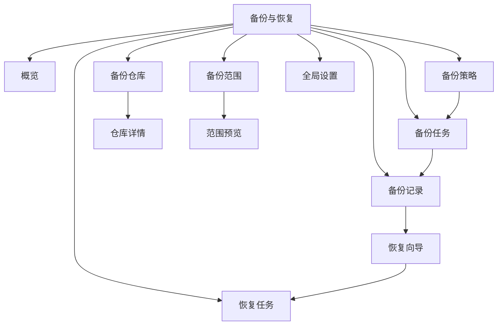

# 容器平台备份与恢复插件：产品功能与页面设计

> 当前仓库发行物为单集群管理员/单租户 Operator；本文件描述的页面与 REST API 是管理员控制台目标设计。普通用户不得直接访问 Cluster-scoped CRD。未来若向普通用户开放，必须在 Operator 之外增加平台 API/外部 ACL，并在每次执行时复验 Namespace 权限；页面中的 Namespace 选择不是授权机制。

## 1. 信息架构与菜单



| 菜单 | 页面目标 | 角色 | 数据来源 | 核心操作 | 关键状态 | 主要跳转 |
|---|---|---|---|---|---|---|
| 概览 | 展示保护覆盖、成功率、容量、风险 | 集群管理员 | 聚合 API/Prometheus | 查看告警、创建策略、立即备份、发起恢复 | Repo 不可用、任务失败、记录损坏/过期 | Repo/Task/Record 详情 |
| 备份仓库 | 管理副本目的地 | 集群管理员 | Repository API | 新建、编辑、测试、停用、删除 | Ready/Degraded/Unavailable/Deleting | 新建/详情 |
| 备份范围 | 管理资源选择模板 | 集群管理员 | Scope/Discovery/Preview API | 新建、复制、预览、编辑、删除 | Ready/Invalid/Previewing | 预览/策略新建 |
| 备份策略 | 管理调度与保留 | 管理员 | Policy API | 新建、复制、启停、立即执行、删除 | Enabled/Paused/Invalid | Task 列表/新建策略 |
| 备份任务 | 观察单次执行 | 集群管理员 | Task/Log API | 查看、取消、重试 | 完整 BackupTask phase | Task 详情/Record 详情 |
| 备份记录 | 管理可恢复资产 | 集群管理员 | Record/Check API | 校验、恢复、删除 | Available/Broken/SnapshotMissing/RepoUnavailable/Expired/Deleting | Record 详情/恢复向导 |
| 恢复任务 | 观察恢复执行 | 集群管理员 | Restore/Log API | 查看、取消、失败对象导出 | 完整 RestoreTask phase | Restore 详情/Record 详情 |
| 全局设置 | 设置默认、安全、并发、GC、通知 | 集群管理员 | Config API | 编辑、验证、查看生效版本 | Ready/Invalid/Reconciling | 审计/测试通知 |

## 2. 全局交互规范

### 2.1 状态、加载、空态与错误

- 状态统一用“图标 + 中文 + 英文 phase tooltip”，不得仅以颜色表达；`PartiallyFailed` 显示橙色“部分失败”，并在列表直接显示成功/失败数。
- 列表采用服务端分页，默认 20 条；筛选条件写入 URL；轮询任务页 5 秒一次，页面不可见时降至 30 秒，终态停止轮询。
- 首屏骨架屏；局部操作用行内 loading；超过 10 秒显示“仍在处理中”和请求 ID；失败保留用户输入并提供错误码、可重试建议与复制排障信息。
- 空态分为“无数据”“无搜索结果”“无权限”“功能/能力不支持”；无权限不可展示创建按钮或对象名称。
- 时间展示用户时区，同时 tooltip 给出 RFC3339/策略 timezone；字节使用 IEC 单位。
- destructive 操作均显示影响清单；Record 删除要求输入记录名称并选择删除模式；集群恢复/Overwrite 再输入目标集群名称。

### 2.2 通用访问边界与数据保护

- 当前控制台仅面向集群管理员；普通用户的入口、路由和全部操作按钮均关闭，其 Kubernetes 凭据也不得拥有核心 CRD 权限。未来前端按钮鉴权仅改善体验，外部 ACL/API 仍须再次校验。
- SFTP 密码、私钥、加密密钥永不回显；编辑时仅显示 Secret 引用和“已配置”。known_hosts 可显示指纹摘要。
- 详情页展示创建时间、最近修改人、trace/request ID 和关联 cluster；不展示 Secret 内容。
- 表格导出最多 10,000 条；日志下载需要管理员会话，默认脱敏。

### 2.3 通用表单规则

| 字段 | 校验/默认 |
|---|---|
| 名称 | DNS-1123，1–63 字符；创建后不可改 |
| clusterRef | 必填，来自当前单集群上下文，创建后不可变；它用于路由和同集群引用校验，不是用户授权字段 |
| 标签选择器 | Kubernetes LabelSelector 结构；同时提供表单和 YAML 模式 |
| Duration | Go duration（`30m`,`24h`），不得为负；UI 提供单位输入 |
| Cron | 5 字段；不接受秒、`TZ=`/`CRON_TZ=`；实时显示未来 5 次执行 |
| timezone | IANA 时区，默认 `Etc/UTC` |
| SecretRef | namespace 默认 `backup-system`；仅列出有权引用的 Secret 元数据 |

## 3. 页面详细设计

### 3.1 概览

| 维度 | 设计 |
|---|---|
| 页面目标/角色 | 一屏识别未保护工作负载、失败任务、损坏记录和容量风险；仅集群管理员查看 |
| 布局 | 顶部上下文与时间范围；KPI 卡（策略覆盖率、24h 成功率、可用记录、Repo 可用容量）；中部趋势图；底部风险与最近任务 |
| 查询条件 | cluster、24h/7d/30d、策略/Repo |
| 字段/状态 | 最近任务：名称、触发、策略、Scope、开始、耗时、进度、phase；风险：级别、对象、错误码、首次/最近发生 |
| 操作/条件 | “新建策略”需 policy.create；“立即备份”需 backup.execute；“发起恢复”需 restore.create 且有 Available Record |
| 表单/校验/默认 | 快捷备份选择 Scope/Repo/超时，默认继承全局；提交前显示预计资源/PVC 数 |
| 错误/空/加载 | 聚合部分失败时卡片标“数据不完整”；无策略显示配置引导；无权限显示范围说明；骨架屏 |
| 删除/二次确认 | 无直接删除操作 |
| 跳转/API | 卡片到对应过滤列表；`GET /overview`、`GET /alerts`、`POST /backup-tasks` |

### 3.2 备份仓库列表

| 维度 | 设计 |
|---|---|
| 页面目标/角色 | 查看 Repo 健康、类型、容量和引用；集群管理员管理 |
| 布局/查询 | 顶部搜索与新建；筛选 cluster、type、phase、enabled；表格+分页 |
| 列表字段 | 名称、类型、集群、端点摘要/挂载摘要、健康、可用/总容量、策略数、记录数、最近检查、创建人 |
| 状态展示 | Ready 绿、Degraded 橙、Unavailable 红、Validating 蓝、Deleting 灰；容量未知显示“服务端不支持” |
| 操作/条件 | 查看；测试连接（非 Deleting）；编辑（repo.update）；停/启用；删除仅无启用策略且通过保护校验 |
| 表单/校验/默认 | 列表无表单；批量操作仅支持健康检查，不支持批量删除 |
| 错误/空/加载 | 检查超时行内错误；无 Repo 引导新建；无筛选结果清除筛选；分页 skeleton |
| 删除确认 | 预检列出 Policy/Record 引用；有记录默认禁止，管理员显式确认后才可 orphan；输入 Repo 名称二次确认 |
| 跳转/API | 名称→详情；`GET /repositories`、`POST /repositories/{name}:check`、`DELETE /repositories/{name}` |

### 3.3 新建和编辑备份仓库

| 维度 | 设计 |
|---|---|
| 页面目标/布局 | 分步：基本信息→类型配置→安全/性能→连通性测试→确认；集群管理员 |
| 通用字段 | name、displayName、clusterRef、type、enabled、description、labels、compression、encryption、checksum、healthCheckInterval、lowSpaceThreshold |
| Local 字段 | mode=`HostPath|PVC`；hostPath；nodeName/nodeSelector；PVC secret-free 引用 namespace/name、mountPath、subPath；fileMode/dirMode；minFreeBytes |
| SFTP 字段 | host、port=22、basePath、auth=`Password|PrivateKey`；username/password/privateKey/passphrase SecretRef；knownHosts SecretRef；connect/read/write timeout；maxConnections=4；tempSuffix=`.part` |
| 校验 | path 绝对且不能 `/`/`..`；host 非 URL；port 1–65535；known_hosts 必填；Secret key 存在但内容不回显；Local PVC 已 Bound；node 可调度 |
| 操作/按钮 | 上一步/下一步；“测试连接”成功后才能提交；编辑 immutable 字段禁用并说明需新建 Repo |
| 默认/错误 | compression gzip level 6、SHA-256、30m 健康检查；错误关联具体字段并给错误码；测试残留自动清理 |
| 空/加载/权限 | Secret 列表无权限显示联系管理员；测试显示 DNS→TCP→认证→路径→读写→删除→容量步骤 |
| 二次确认/跳转/API | 开启 insecure 仅测试环境且二次确认；成功到详情；`POST/PUT /repositories`、`:check?draft=true` |

### 3.4 备份仓库详情

| 维度 | 设计 |
|---|---|
| 页面目标/布局 | Header 状态与操作；Tabs：概览、健康历史、关联策略、备份记录、事件、YAML（脱敏） |
| 字段 | capability、endpoint/mount、容量、最近成功/失败检查、失败原因、SecretRef、压缩/加密、引用计数、finalizer |
| 查询 | 关联项按状态/时间；事件按级别 |
| 操作/条件 | 测试、编辑、启停、从该 Repo 创建策略；删除条件同列表 |
| 状态/错误 | 显示 condition type/reason/message/transitionTime；RepoUnavailable 提供 DNS/凭据/host key/空间排查入口 |
| 空/加载/权限 | 无历史检查/记录独立空态；非管理员 YAML 隐藏敏感引用 key |
| 删除/跳转/API | 同列表二次确认；跳策略/Record；`GET /repositories/{name}`、relations、events |

### 3.5 备份范围列表

| 维度 | 设计 |
|---|---|
| 目标/角色 | 管理可复用选择规则；集群管理员 |
| 查询/字段 | cluster、mode、phase、hasSnapshots、关键字；名称、模式、Namespace 摘要、GVR 摘要、标签、PVC、预估对象数、策略数、最近预览 |
| 操作 | 新建、复制、编辑、预览、基于范围建策略、删除 |
| 可用条件 | Scope Ready 才可建策略；被启用 Policy 引用时不可删；普通用户无页面访问权限 |
| 状态/错误/空/加载 | Ready/Invalid/Stale/Previewing；Discovery 变化后 Stale；无范围引导创建 |
| 删除确认 | 展示引用策略；仅全部禁用/删除引用后可删，输入名称 |
| API/跳转 | `GET/DELETE /scopes`、`:preview`；到编辑/预览/策略 |

### 3.6 新建和编辑备份范围

| 维度 | 设计 |
|---|---|
| 布局 | 四步：范围模式→资源过滤→PVC/一致性→预览确认 |
| 基本字段 | name、clusterRef、mode=`Cluster|Namespace`、includeNamespaces、excludeNamespaces |
| 资源字段 | includeResources/excludeResources（规范 GVR/GVR pattern）、labelSelector、includeClusterResources、include/excludeClusterResources、includeSecrets、includeCRDs、includeCustomResources |
| PVC 字段 | includePVC、include/excludePVCNames、PVC labelSelector、snapshotClassName/按 driver 映射、failurePolicy、snapshotTimeout、lifecycle、consistencyMode |
| 校验/规则 | exclude 优先；include `*` 不与显式值混用；includeCR=false 时集群资源选择禁用；Hook enabled 在 V1.0 拒绝；Namespace 列表只控制选择范围 |
| 默认 | Namespace 模式不自动推导 Namespace，管理员必须显式选择；默认排除运行时资源；Secret/CRD/CR false；PVC true；CrashConsistent；快照失败=Fail |
| 操作 | 保存草稿、预览、提交；编辑保存后仅新 Task 使用，新旧 hash 并列 |
| 错误/空/加载 | Discovery 加载失败可保存草稿但不可 Ready；0 资源需确认且 Scope=Invalid 不可用于策略 |
| 权限/API | UI + API 校验；`GET /clusters/{id}/resources`、`POST /scope-previews`、`POST/PUT /scopes` |

### 3.7 备份范围预览

| 维度 | 设计 |
|---|---|
| 目标/布局 | 顶部风险汇总；按 Namespace/GVR/PVC Tabs；右侧规则命中说明；可折叠抽样对象 |
| 查询/字段 | Namespace、GVR、标签、included/excluded、snapshotCapable；对象名、原因、估算 YAML bytes、owner、PVC/SC/driver/VSC |
| 状态 | Complete/Partial/Failed；能力：Supported/Unsupported/Unknown；风险 Blocking/Warning/Info |
| 操作/条件 | 刷新、导出摘要、返回编辑、确认创建；Partial 必须确认，Blocking 不能提交 |
| 校验/默认 | Preview TTL 10m；提交时校验 scope hash 未变；未来外部 ACL 上线后还必须校验授权版本 |
| 错误/空/加载 | 分页错误保留已统计数据；0 资源说明过滤命中；进度显示 discovery/list/pvc-check |
| 权限/跳转/API | 当前仅集群管理员可见对象名；`POST /scope-previews`、`GET /scope-previews/{id}` |

### 3.8 备份策略列表

| 维度 | 设计 |
|---|---|
| 目标/查询 | 管理 RPO；cluster、enabled、health、Repo、Scope、trigger window |
| 字段 | 名称、Scope、Repo、Cron/timezone、启用、并发、保留、上次/下次执行、最近结果、连续失败数 |
| 状态 | Enabled/Paused/Invalid/Degraded；最近 Task 单独 phase，不混为策略 phase |
| 操作 | 新建、编辑、复制、启停、立即执行、查看任务、删除 |
| 条件 | Repo/Scope Ready 方可启用/立即执行；活动 Task 不受停用影响；无 policy.delete 不显示删除 |
| 默认/错误/空/加载 | 开启确认未来 5 次；Invalid 显示引用/cron 原因；无策略展示 RPO 引导 |
| 删除确认/API | 明示“不会删除历史任务和副本”；输入名称；`GET/DELETE /policies`、`:enable/:disable/:run` |

### 3.9 新建和编辑备份策略

| 维度 | 设计 |
|---|---|
| 布局 | 基本信息→备份内容/目的地→调度→保留/失败→通知→确认 |
| 字段 | name、clusterRef、scopeRef、repositoryRef、cron、timezone、enabled、suspend、concurrencyPolicy、missedRunPolicy/window/maxCatchUpRuns、retention.count/age、snapshotLifecycle、retry、timeout、notification |
| 校验 | Scope、Repo 与 Policy 的 `clusterRef` 必须相同；count 1–10,000 或空，age 1h–3650d；Forbid/Replace 规则明确；RunAll maxCatchUpRuns ≤10 |
| 默认 | enabled=false（创建后确认开启）；Forbid；Skip；count=7、age=30d；retry 3；timeout 4h；Etc/UTC |
| 操作 | 保存草稿、保存并启用、预览未来 5 次、复制；立即执行走独立确认，不修改策略 |
| 错误/加载/权限 | DST 重复/跳过在预览标识；无可用 Repo/Scope 显示前置入口；普通用户无页面访问权限 |
| 修改影响 | 明示只影响之后创建的 Task，已有 Task/Record 不变；scope/repo 引用更新时保存 UID |
| API/跳转 | `POST/PUT /policies`、`POST /policies:validate`；成功到详情/列表 |

### 3.10 备份任务列表

| 维度 | 设计 |
|---|---|
| 目标/查询 | 观察执行；cluster、trigger、policy、phase、时间、errorCode |
| 字段 | 名称、触发、策略、Scope/Repo、phase、当前步骤、对象/PVC 进度、大小、开始/耗时、创建人、Record |
| 状态 | 展示全部 phase；PartiallyFailed 显示失败对象/PVC 数 |
| 操作/条件 | 查看；活动任务取消；Failed/PartiallyFailed 可重试；Completed 且 Record 可用跳记录 |
| 表单 | 手动新建抽屉：策略或 Scope+Repo、timeout、failurePolicy；默认继承 |
| 错误/空/加载 | 状态延迟显示最近更新时间；超过 2 分钟无 heartbeat 标 Stalled 警告，不自行改终态 |
| 删除 | V1.0 不在 UI 删除 Task；由历史保留设置清理终态 Task CR，Record 不受影响 |
| API | `GET/POST /backup-tasks`、`:cancel`、`:retry` |

### 3.11 备份任务详情

| 维度 | 设计 |
|---|---|
| 布局 | Header；步骤时间轴；KPI；Tabs：资源、PVC/快照、错误、日志、事件、参数快照、YAML |
| 字段 | phase、percent、currentStep、counts、bytes、node/pod、attempt、start/end/heartbeat、conditions、errorCode/message、related Task/Record |
| 操作 | 取消、重试、复制手动任务、查看 Record、下载脱敏日志 |
| 条件 | 仅活动 phase 可取消；终态不可取消；重试仅可重试错误或管理员强制且创建新 Task |
| 状态/错误 | 步骤列入/出时间、重试次数；错误支持按 GVR/Namespace/PVC 过滤并导出 CSV |
| 空/加载/权限 | 无 PVC 显示“范围未包含 PVC”；日志流断开可重连；Secret 对象内容不可查看 |
| 二次确认/API | 取消确认说明快照/临时包补偿；`:cancel/:retry`、`GET /logs?follow=true` |

### 3.12 备份记录列表

| 维度 | 设计 |
|---|---|
| 目标/查询 | 选择可靠恢复点；cluster/repo/availability、策略、时间、到期、含 PVC |
| 字段 | 名称/副本 ID、来源 Task/Policy、范围、Repo、创建时间、资源/PVC/快照、大小、availability、到期、恢复次数 |
| 状态 | Available/Verifying/Broken/SnapshotMissing/RepoUnavailable/Expired/Deleting |
| 操作 | 查看、校验、发起恢复、删除；仅 Available 或 SnapshotMissing 且仅元数据恢复才可进入向导 |
| 错误/空/加载 | RepoUnavailable 仍显示索引缓存和最后可访问时间；Expired 默认隐藏可筛选 |
| 删除确认 | 选择 CROnly/Data/DataAndSnapshots，列出精确影响；输入记录名并确认影响；未来代理 API 上线后增加短期 token |
| API/跳转 | `GET /backup-records`、`:verify`、`:delete`；到详情/恢复向导 |

### 3.13 备份记录详情

| 维度 | 设计 |
|---|---|
| 布局 | 可恢复性横幅；元信息；Tabs：资源索引、PVC/快照、完整性、恢复历史、Repo 文件、事件、YAML |
| 字段 | backupID、source cluster/namespaces、repo/path、format/operator/k8s version、checksum/algorithm、counts/bytes、expires、availability、lastVerified、restore count/time |
| 操作 | 恢复、仅元数据恢复、立即校验、延长保留（创建保护 override）、删除、复制 ID |
| 条件 | Broken 不可恢复；SnapshotMissing 可关闭 PVC 后恢复；RepoUnavailable 不可下载；Expired 需管理员解除保护/延长 |
| 错误/空/加载 | 索引按 GVR 分页；校验流显示 header/index/archive/snapshot；无快照说明元数据备份 |
| 删除/权限/API | 三模式二次确认；当前仅集群管理员可见；`GET /backup-records/{name}`、resources、snapshots、restores、`:verify/:delete` |

### 3.14 恢复向导


| 步骤 | 字段/默认 | 校验与交互 | API |
|---|---|---|---|
| 1 记录 | recordRef name+uid；默认从详情带入 | 仅 Available；SnapshotMissing 可选择“仅元数据”；显示版本/到期/完整性 | `GET /backup-records?availability=Available` |
| 2 目标集群 | V1.0 固定 source cluster；模式 Original/New/Mapping | 跨集群选项禁用并说明 V2.0；校验 `clusterRef` 和版本 | `POST /restore-prechecks/target` |
| 3 Namespace 映射 | source→target；未映射默认同名 | 目标 DNS-1123、不得重复汇聚（除管理员显式允许）；当前由集群管理员确认目标，映射本身不表示授权 | `POST /restore-prechecks/namespaces` |
| 4 资源 | GVR 树、对象选择、includeClusterResources、metadataOnly | 默认记录内全部资源；依赖自动勾选并可解释；普通用户无向导访问权限 | `GET /backup-records/{id}/resources` |
| 5 PVC/SC | restorePVC、逐 PVC include、target SC、size、snapshot | 默认恢复 PVC；V1.0 SC 同名；SnapshotMissing 自动禁用；工作负载依赖 PVC 时给阻断/警告 | `POST /restore-prechecks/volumes` |
| 6 冲突 | 全局 Skip，按 GVR 覆盖；Overwrite/Rename/Fail/MergePatch(禁用)；allowRecreate | 默认 Skip；Rename 限白名单；高危 Overwrite 需权限；显示不可变字段策略 | `POST /restore-prechecks/conflicts` |
| 7 预检查 | 无新增字段；执行 plan | 展示 Blocking/Warning/Info、对象 Diff 摘要、配额、Webhook/CRD/CSI；修复后重跑；plan TTL 10m | `POST /restore-plans`、`GET /restore-plans/{id}` |
| 8 确认 | task name、timeout、failurePolicy、确认声明 | planHash/recordUID 未变；集群级/Overwrite 输入目标集群名；提交后 spec 不可改 | `POST /restore-tasks` |

向导通用：草稿仅保存在浏览器会话 24h，不包含凭据；离开时提示未提交。预检查有 Blocking 时提交禁用；仅 Warning 需逐项确认。提交成功跳恢复任务详情。

文字线框图：

```text
┌ 进度：①记录—②集群—③NS—④资源—⑤PVC—⑥冲突—⑦预检—⑧确认 ┐
│ 左：当前步骤表单/资源树                    右：恢复摘要             │
│ [搜索][过滤]  source -> target             Record / Cluster        │
│ □ deployments.apps                         Namespace / PVC / 冲突  │
│   ☑ ns-a/web (依赖: sa,secret,pvc)         阻断 0 / 警告 2         │
├───────────────────────────────────────────────────────────────┤
│ [保存会话] [上一步]                                [下一步/提交] │
└───────────────────────────────────────────────────────────────┘
```

### 3.15 恢复任务列表

| 维度 | 设计 |
|---|---|
| 目标/查询 | 查看恢复结果；cluster、record、phase、目标 Namespace、时间 |
| 字段 | 名称、Record、目标集群/Namespace 摘要、phase/步骤、对象/PVC 成功失败、开始/耗时、发起人 |
| 操作/条件 | 查看；活动任务取消；Failed/PartiallyFailed 显示“重试”；重试先重跑预检查，成功后创建新 RestoreTask，阻断时打开带原参数的向导 |
| 状态/错误 | 完整 Restore phase，PartiallyFailed 橙色；预检查失败和执行失败分开 |
| 空/加载/权限 | 无任务引导从 Record 发起；当前仅集群管理员查看；轮询规则同 Task |
| 删除/API | V1.0 不直接删除；历史 GC 不影响 Record；`GET /restore-tasks`、`:cancel`、`:retry` |

### 3.16 恢复任务详情

| 维度 | 设计 |
|---|---|
| 布局 | Header；恢复顺序时间轴；KPI；Tabs：计划、Namespace、PVC、资源、冲突/变更、错误、日志、事件 |
| 字段 | phase、planHash、record UID、target、mapping、conflict decisions、counts、start/end/heartbeat、condition、errorCode |
| 操作 | 取消、重试（新任务）、查看 Record、导出失败对象、基于当前设置新建恢复、下载审计报告 |
| 条件 | 活动 phase 可取消；PVC 已创建后取消不自动删除用户数据，报告残留资源 |
| 错误/空/加载 | 每对象 action=`Created|Skipped|Updated|Renamed|Failed`；日志流重连；空步骤说明未选择 |
| 权限/二次确认/API | 当前仅集群管理员可见计划；取消确认残留影响；重试需重新确认高危策略；`GET /restore-tasks/{id}`、resources、logs、`:cancel/:retry` |

### 3.17 全局设置

| 维度 | 设计 |
|---|---|
| 目标/角色 | 集群管理员设置控制器默认、安全边界、配额、GC/告警 |
| 布局 | Tabs：常规、执行与并发、Repo/临时空间、安全与加密、保留/GC、通知、兼容矩阵、审计 |
| 字段 | defaultTimeout/retry/timezone；max tasks/snapshots/SFTP；secret namespaces；encryption required；temp path/min bytes；health/verify/GC interval；notification SecretRef |
| 校验/默认 | 所有值在 CRD 上限内；降低并发只影响新调度；删除 Secret namespace 前检查引用；单例 name=`cluster` |
| 状态/操作 | 保存、验证、恢复系统默认、测试通知；Ready/Invalid/Reconciling 与 observedGeneration |
| 错误/空/加载 | 无对象时展示系统默认但需“初始化配置”；保存失败显示旧生效版本；版本矩阵数据加载失败不阻止查看 |
| 二次确认 | 关闭 host key/encryption、缩短 GC grace、降低 retention 上限需高危确认；生产模式可永久禁止不安全选项 |
| API/跳转 | `GET/PUT /plugin-config/cluster`、`:validate`、`:test-notification`、审计 API |

## 4. 关键跳转与操作闭环

1. Scope 预览通过 → “基于此范围创建策略”带入 `scopeRef`。
2. Policy “立即执行” → 创建 Manual Task（保留 `policyRef` 供追踪）→ Task 详情。
3. BackupTask `Completed/PartiallyFailed` 且产生 Record → Record 详情；无 Record 时显示“未形成可恢复副本”。
4. Record Available → 恢复向导 → Precheck plan → RestoreTask 详情。
5. 任一错误码 → 详情错误 Tab；集群管理员可跳到 Repo/Scope/Config 关联对象。
