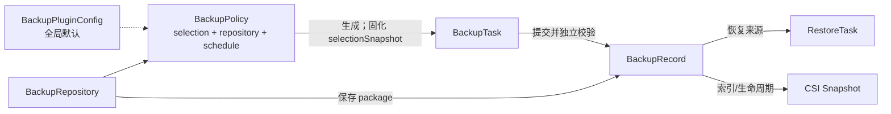

# 容器平台备份与恢复插件：CRD 对象设计

## 1. 对象清单

全部对象使用 `protection.platform.io/v1alpha1`，均为 Cluster-scoped。

| Kind | plural | shortName | 职责 |
|---|---|---|---|
| BackupRepository | backuprepositories | brepo | 备份包存储目的地、健康与容量 |
| BackupPolicy | backuppolicies | bpolicy | 保护范围、目的地、调度、保留和执行默认值 |
| BackupTask | backuptasks | btask | 一次备份执行及冻结参数 |
| BackupRecord | backuprecords | brecord | 不可变、可校验、可恢复的长期资产 |
| RestoreTask | restoretasks | rtask | 一次恢复执行 |
| BackupPluginConfig | backuppluginconfigs | bpconfig | 全局配置单例 |

`BackupScope` 已被删除。选择范围不再作为独立对象复用，而是唯一存放在 `BackupPolicy.spec.selection` 中。手动 `BackupTask` 也不接受 selection 或 repository 输入，只接受 `policyRef`。

`clusterRef` 用于控制器路由和同集群边界校验，不表示终端用户权限。当前发行物仅允许集群管理员访问这些 CRD。

## 2. 对象关系



关系基数：

- 一个 Policy 可产生多个 Task。
- 一个 Task 最多产生一个 Record；失败或取消任务可以没有 Record。
- 每个 Record 必须同时保存来源 Policy 和来源 Task。
- Task 是短期执行历史，Record 是长期恢复资产，两者删除不级联。

## 3. BackupPolicy

Policy 是备份意图的唯一入口：内容、目的地、调度和保留规则作为一个对象保存。

```yaml
apiVersion: protection.platform.io/v1alpha1
kind: BackupPolicy
metadata:
  name: project-a-nightly
spec:
  clusterRef: cluster-a
  repositoryRef: {name: sftp-primary}
  selection:
    mode: Namespace
    includeNamespaces: [project-a, project-a-data]
    excludeNamespaces: []
    resources:
      include: [deployments.apps, statefulsets.apps, services, configmaps, secrets, persistentvolumeclaims]
      exclude: [pods, events]
    labelSelector:
      matchLabels: {backup.platform.io/enabled: "true"}
    includeClusterResources: false
    includeSecrets: true
    includeCRDs: false
    includeCustomResources: true
    pvc:
      enabled: true
      snapshotTimeout: 10m
      failurePolicy: ContinueAndMarkPartial
      lifecycle: RetainAfterRecordDeletion
    consistencyMode: CrashConsistent
  schedule: {cron: "0 2 * * *", timezone: Asia/Shanghai}
  enabled: true
  suspend: false
  concurrencyPolicy: Forbid
  missedRunPolicy: RunOnce
  startingDeadline: 1h
  maxCatchUpRuns: 1
  retention: {maxCopies: 7, minCopies: 1, maxAgeDays: 30, deleteSnapshots: false}
  retryPolicy: {maxAttempts: 3, backoff: 30s, maxBackoff: 10m}
  timeout: 4h
```

选择规则：

- `Namespace` 模式必须显式提供 `includeNamespaces`；exclude 优先。
- `Cluster` 模式禁止 `includeNamespaces`，并通过 `includeClusterResources` 和集群资源白名单控制范围。
- `includeSecrets=true` 时 Repository 必须启用加密。
- V1.0 仅执行 `CrashConsistent`；Hook 字段保留但 Admission 拒绝非空配置。
- Policy 修改仅影响之后创建的 Task。

Policy Controller 每 10 分钟或 generation 变化时刷新 `status.selectionPreview`：Namespace、资源类型、对象、PVC、可快照 PVC、风险数量和 selection hash。Repository 不 Ready 或预览失败时 Policy 为 `Degraded/Invalid`，不得生成新 Task。

## 4. BackupTask

Task 必须引用 Policy。定时 Task 创建时已经固化参数；手动 Task 可只提交以下字段：

```yaml
apiVersion: protection.platform.io/v1alpha1
kind: BackupTask
metadata:
  name: project-a-emergency-20260716
spec:
  clusterRef: cluster-a
  trigger: Manual
  policyRef: {name: project-a-nightly}
  timeout: 4h
  failurePolicy: Continue
  allowPartialRecord: true
  idempotencyKey: project-a/emergency/2026-07-16
```

Controller 在 Pending 阶段仅允许一次解析并写入：

```yaml
spec:
  policyRef: {name: project-a-nightly, uid: "..."}
  policyGeneration: 3
  repositoryRef: {name: sftp-primary, uid: "..."}
  repositoryGeneration: 2
  selectionSnapshot: {...}
```

之后除 `cancelRequested/cancelReason` 外 spec 全部不可变。任务运行只使用 `selectionSnapshot`，不受 Policy 后续修改或删除影响。

Task 通过 `status.recordRef` 指向生成的 Record。Task Completed 只表示执行流程完成；是否真正可恢复必须读取 Record 的 availability 和 `restorable`。

## 5. BackupRecord

Record 只能由 Controller 创建，spec 全部不可变，且必须包含：

- `sourceTaskRef{name,uid}`；
- `policyRef{name,uid}`；
- `repositoryRef{name,uid}`；
- backupID、路径、checksum、格式版本、inventory、snapshot 和 expiresAt。

availability：`Available|PartiallyAvailable|Verifying|Broken|SnapshotMissing|RepoUnavailable|Expired|Deleting|Deleted`。只有 `status.restorable=true` 的恢复点可进入正常恢复流程。

删除必须显式选择：

- `RecordOnly`：仅删除 CR；
- `RepositoryData`：删除 CR 和备份包；
- `RepositoryDataAndSnapshots`：再删除受管快照。

所有模式都要求二次确认 annotation，并由 finalizer 幂等执行资产清理。

## 6. BackupRepository、RestoreTask 与全局配置

Repository 保持独立，因为它可被多个 Policy 和历史 Record 共享，并拥有独立健康、容量、凭据和删除保护生命周期。

RestoreTask 必须引用明确的 `BackupRecord` name+UID，执行前校验可恢复性、checksum、目标集群、Namespace 映射、PVC/StorageClass 和冲突策略。RestoreTask 删除不回滚已恢复资源，也不删除 Record。

BackupPluginConfig 是名称固定为 `cluster` 的单例，由 Helm 创建和维护。它提供默认超时、并发、Secret Namespace、安全、Kubernetes Client 和 GC 配置，不与业务对象合并。

## 7. 删除和保留语义

| 删除对象 | 行为 |
|---|---|
| BackupPolicy | 停止调度；不删除历史 Task/Record |
| BackupTask | 活动期先取消；不删除 Record |
| BackupRecord | 按三种删除模式处理 CR、包和快照 |
| BackupRepository | 有启用 Policy 或 Record 时默认阻止 |
| RestoreTask | 不影响 Record，不回滚业务资源 |
| BackupPluginConfig | 不级联任何对象 |

历史链不使用 Kubernetes ownerReference 级联，而使用 name+UID、索引标签和 finalizer 管理，避免误删长期恢复资产。
