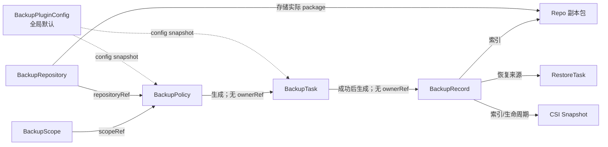

# 容器平台备份与恢复插件：CRD 对象设计

## 1. 通用规范

### 1.1 API 与元数据

所有对象均为 Cluster-scoped：

| Kind | plural | shortName | 作用 |
|---|---|---|---|
| BackupRepository | backuprepositories | brepo | 存储目的地 |
| BackupScope | backupscopes | bscope | 资源选择模板 |
| BackupPolicy | backuppolicies | bpolicy | 调度与保留模板 |
| BackupTask | backuptasks | btask | 一次备份执行 |
| BackupRecord | backuprecords | brecord | 可恢复副本资产 |
| RestoreTask | restoretasks | rtask | 一次恢复执行 |
| BackupPluginConfig | backuppluginconfigs | bpconfig | 全局配置单例 |

统一 `apiVersion: protection.platform.io/v1alpha1`。`metadata.name` 为 DNS-1123；禁止 `metadata.namespace`。当前版本仅保留集群路由标签；管理员或控制器可写审计 annotation：

```yaml
metadata:
  labels:
    protection.platform.io/cluster: cluster-a
  annotations:
    protection.platform.io/creator: cluster-admin
    protection.platform.io/creator-type: ClusterAdmin
    protection.platform.io/request-id: req-uuid
```

`clusterRef` 与 cluster label 用于控制器路由和索引，不是终端用户授权字段。当前仓库发行物是单集群管理员/单租户 Operator，普通用户不得直接访问这些 Cluster-scoped CRD。未来多租户必须由平台外部 ACL/API 实现对象可见性，并在执行时复验 Namespace 权限；`includeNamespaces` 仅是资源选择参数。控制器写 `status.observedGeneration`；用户不得写 status。时间均 RFC3339 UTC；Duration 使用 Kubernetes duration 字符串。

### 1.2 通用引用与 Secret

CRD 引用保存 `name`；Controller 首次解析后在 Task/Record 快照中保存 UID，防止同名重建：

```yaml
scopeRef:
  name: app-prod
secretRef:
  namespace: backup-system
  name: sftp-prod
  key: password
```

SecretRef 的 namespace/name/key 均必填；不提供 `optional`；不得在 CR 中出现 password/privateKey/passphrase/encryptionKey 明文。

### 1.3 通用 Condition

所有对象使用 `metav1.Condition`：`type,status,observedGeneration,lastTransitionTime,reason,message`。通用 type：`Ready`、`Validated`、`Progressing`、`Degraded`、`Deleting`；任务另有 `Cancellable`、`Retryable`；记录另有 `IntegrityVerified`、`SnapshotsAvailable`、`RepositoryAccessible`。同一 type 仅一条，按 type 排序；message 最大 1 KiB，不含凭据。

### 1.4 字段变更分类

- **不可变**：身份、目标集群、Repo 类型/根路径、Task/Record/Restore 执行快照和来源。变更需创建新对象。
- **热更新（只影响未来）**：Scope 过滤、Policy 调度/保留/重试、Repo 凭据/timeout/限流、PluginConfig 默认值。已存在 Task 固化快照，不受影响。
- **运行控制**：Task/Restore 仅 `spec.cancelRequested` 可从 false→true；Policy `enabled/suspend` 可热更新。
- `status` 仅 Controller 更新；Record 的删除参数不修改 spec，通过受保护 annotation/action API 传入并写入 status.deletion。

### 1.5 访问模型与升级风险

- 当前 schema 不包含面向项目或租户的身份字段；六个业务 CRD 及 `BackupTask.spec.scopeSnapshot` 只保留 `clusterRef`。这意味着同集群引用仅做集群边界校验，不提供对象所有权隔离。
- 从包含旧身份字段的 `v1alpha1` 升级属于客户端破坏性变更：旧 YAML/SDK 可能收到 unknown-field 错误或字段被 API Server 剪枝。升级前应导出对象，应用新 CRD 后重写并检查存量对象与旧 label；旧备份包不得原地修改，否则会破坏 checksum。
- Helm 不会在 `helm upgrade` 时自动升级 `crds/`；存量安装必须由管理员显式应用新 CRD。全新安装不需要数据迁移。
- 多租户是未来平台能力：必须新增外部 ACL/API、审计、对象可见性过滤和 Namespace 执行时复验。不得通过恢复已删除的身份字段，也不得把 `includeNamespaces` 当作授权来简化实现。

## 2. BackupRepository

### 2.1 设计规则

Local：

- `HostPath` 必须指定 `nodeName` 或 `nodeSelector`；执行 Job 强制同节点，Operator Pod 可漂移，因为 I/O 由带节点约束的执行 Job 完成。根路径不得为 `/`、kubelet/container runtime 目录。
- `PVC` 引用 Namespaced PVC，支持 RWO/RWX；RWO 时 Repo 并发强制 1 且 Job 调度到可挂载节点，RWX 可按全局上限。PVC 必须 Bound，mountPath 固定为 `/repository`，用户仅配置安全 `subPath`。
- 不自动 chmod 宿主任意目录；探测 effective UID/GID 是否可创建/rename/fsync/delete。容量用 `statfs`；低空间为 Degraded，低于预计大小+reserve 时 Task 失败。
- Local 是单故障域，UI 必须显示“非异地灾备”；HostPath 节点不可用时 Repo=Unavailable。

SFTP：

- 支持 password 或 private key（可带 passphrase），用户名也可 SecretRef；强制 known_hosts 精确匹配 hostname/IP+port。连接、握手、读写、空闲 timeout 分开。
- 上传到 `<basePath>/.staging/<backupID>/<file>.part`；全部 fsync/close 后，若支持同文件系统 rename，原子移动到 `<basePath>/<backupID>`，最后写 `.done`；不支持目录原子 rename 时逐文件定名，仍以最后创建 `.done` 作为提交点。
- V1.0 不承诺 SFTP 扩展级断点续传；单次 Reconcile 可续写当前流，进程重启后校验 staging 大小并默认整文件覆盖。默认 24h 清理无 owner 活跃任务的 staging。
- 路径由 Controller 基于 backupID 生成，用户不能指定单个 Task 路径；创建目录用 O_EXCL/存在性校验防冲突。容量优先用 SFTP `statvfs@openssh.com`，不支持则 `Unknown`，可配置人工 quota。

通用：压缩在上传前、加密在压缩后；SHA-256 对最终存储字节计算。健康检查包含 DNS/TCP/认证/根路径/read-write-delete/rename/容量。测试文件名带 UUID 并始终清理。Repo 被启用 Policy 引用时禁止删除；有 Record 时默认禁止删除。

### 2.2 spec 字段

| 字段 | 类型/必填 | 默认 | 规则/可变性 |
|---|---|---|---|
| clusterRef | string/是 | - | 目标集群；不可变 |
| type | Local\|SFTP/是 | - | 不可变 |
| enabled | bool/否 | true | 可热更新；false 禁止新 Task |
| local.mode | HostPath\|PVC/Local 必填 | - | 不可变 |
| local.hostPath.path | string/HostPath 必填 | - | 绝对安全路径；不可变 |
| local.hostPath.nodeName | string/条件必填 | - | 与 nodeSelector 二选一；可变需重新验证 |
| local.hostPath.nodeSelector | map/条件必填 | - | 与 nodeName 二选一；可变需重新验证 |
| local.pvc.namespace/name | string/PVC 必填 | - | PVC 引用；不可变 |
| local.pvc.subPath | string/否 | repo name | 无 `..`/绝对路径；不可变 |
| local.permissions.uid/gid | int64/否 | 1000 | 探测值；可变重新验证 |
| local.permissions.dirMode/fileMode | string/否 | `0700`/`0600` | 八进制白名单 |
| sftp.host/port/basePath | string,int32,string/SFTP 必填 | port 22 | host/path 不可变；port 不可变 |
| sftp.auth.type | Password\|PrivateKey/是 | - | 可变并重验证 |
| sftp.auth.usernameRef | SecretKeyRef/是 | - | 可变 |
| sftp.auth.passwordRef | SecretKeyRef/条件 | - | Password 必填 |
| sftp.auth.privateKeyRef/passphraseRef | SecretKeyRef/条件 | - | PrivateKey 必填/可选 |
| sftp.knownHostsRef | SecretKeyRef/是 | - | 可变；内容须含目标 host key |
| sftp.timeouts | object/否 | 10s/10s/5m/30s | connect/handshake/readWrite/idle |
| sftp.maxConnections | int32/否 | 4 | 1–16，可热更新 |
| sftp.tempSuffix | string/否 | `.part` | 不得为空/含 `/`；不可变 |
| capacity.minFreeBytes | quantity/否 | 10Gi | 可变 |
| capacity.reservePercent | int32/否 | 10 | 0–90 |
| capacity.configuredQuotaBytes | quantity/否 | - | 无 statvfs 时人工上限 |
| compression.algorithm/level | None\|Gzip,int/否 | Gzip/6 | 1–9；仅新 Task |
| encryption.enabled/algorithm/keyRef | bool,string,SecretKeyRef/否 | false/AES256GCM | include Secret 时必须启用；key 可轮换，仅新 Task |
| checksum.algorithm | SHA256/否 | SHA256 | V1.0 固定 |
| healthCheck.interval/timeout/failureThreshold | duration/duration/int/否 | 30m/30s/3 | 热更新 |
| deletionProtection | bool/否 | true | true 时需平台审批解除 |

`local` 与 `sftp` 互斥。Repo 不承载保留策略；保留在 Policy/Record。

### 2.3 status、phase 与条件

| 字段 | 类型 | 说明 |
|---|---|---|
| observedGeneration | int64 | 已处理 generation |
| phase | Pending\|Validating\|Ready\|Degraded\|Unavailable\|Deleting | 总态 |
| conditions | []Condition | Ready/Validated/Degraded/Deleting |
| capabilities | object | read,write,delete,atomicRename,statVFS,encryption |
| capacity | totalBytes,availableBytes,usedBytes,source,checkedAt | 未知字段不填 |
| lastCheck | startedAt,completedAt,latencyMillis,errorCode | 最近探测 |
| resolved | nodeName,pvcUID,secretResourceVersions | 执行解析结果，不含 Secret 内容 |
| references | activePolicyCount,recordCount | 删除保护摘要 |

finalizer：`protection.platform.io/repository-protection`，用于检查引用和清理测试/staging 元数据，不默认删除实际历史包。无 ownerReference。

printerColumns：`TYPE=.spec.type`、`CLUSTER=.spec.clusterRef`、`PHASE=.status.phase`、`AVAILABLE=.status.capacity.availableBytes`、`LAST CHECK=.status.lastCheck.completedAt`、`AGE=.metadata.creationTimestamp`。

校验：CEL 约束 type 与配置分支、port/连接数范围、SecretRef 完整；Webhook 校验路径、PVC、Secret namespace、known_hosts 与引用删除。不可变：clusterRef/type、Local mode/path/PVC、SFTP endpoint/basePath/tempSuffix。

### 2.4 示例 YAML

```yaml
apiVersion: protection.platform.io/v1alpha1
kind: BackupRepository
metadata:
  name: sftp-prod
  labels:
    protection.platform.io/cluster: cluster-a
  annotations:
    protection.platform.io/creator: admin-1
spec:
  clusterRef: cluster-a
  type: SFTP
  enabled: true
  sftp:
    host: sftp.example.internal
    port: 22
    basePath: /k8s-backups/cluster-a
    auth:
      type: PrivateKey
      usernameRef: {namespace: backup-system, name: sftp-prod, key: username}
      privateKeyRef: {namespace: backup-system, name: sftp-prod, key: id_ed25519}
      passphraseRef: {namespace: backup-system, name: sftp-prod, key: passphrase}
    knownHostsRef: {namespace: backup-system, name: sftp-prod, key: known_hosts}
    timeouts: {connect: 10s, handshake: 10s, readWrite: 5m, idle: 30s}
    maxConnections: 4
    tempSuffix: .part
  capacity: {minFreeBytes: 10Gi, reservePercent: 10}
  compression: {algorithm: Gzip, level: 6}
  encryption:
    enabled: true
    algorithm: AES256GCM
    keyRef: {namespace: backup-system, name: backup-kek, key: key}
  checksum: {algorithm: SHA256}
  healthCheck: {interval: 30m, timeout: 30s, failureThreshold: 3}
  deletionProtection: true
status:
  observedGeneration: 1
  phase: Ready
  capabilities: {read: true, write: true, delete: true, atomicRename: true, statVFS: true, encryption: true}
  capacity: {totalBytes: 1099511627776, availableBytes: 824633720832, usedBytes: 274877906944, source: StatVFS, checkedAt: "2026-07-13T06:00:00Z"}
  lastCheck: {completedAt: "2026-07-13T06:00:00Z", latencyMillis: 182}
  references: {activePolicyCount: 2, recordCount: 21}
  conditions:
    - {type: Ready, status: "True", observedGeneration: 1, lastTransitionTime: "2026-07-13T06:00:00Z", reason: CheckSucceeded, message: Repository is readable and writable}
```

Local PVC 示例只替换 `type/config`：

```yaml
apiVersion: protection.platform.io/v1alpha1
kind: BackupRepository
metadata: {name: local-rwx}
spec:
  clusterRef: cluster-a
  type: Local
  enabled: true
  local:
    mode: PVC
    pvc: {namespace: backup-system, name: backup-repo-rwx, subPath: cluster-a}
    permissions: {uid: 1000, gid: 1000, dirMode: "0700", fileMode: "0600"}
  capacity: {minFreeBytes: 10Gi, reservePercent: 10}
  compression: {algorithm: Gzip, level: 6}
  encryption: {enabled: false, algorithm: AES256GCM}
  checksum: {algorithm: SHA256}
  healthCheck: {interval: 30m, timeout: 30s, failureThreshold: 3}
  deletionProtection: true
```

## 3. BackupScope

### 3.1 选择与清洗规则

过滤顺序：scope mode → namespace include/exclude → namespaced/cluster GVR include/exclude → Secret/CRD/CR 开关 → labelSelector → 对象级系统排除 → PVC 规则。任一 exclude 优先于 include；资源名在 admission 时由 discovery 规范化为 `plural.group`。当前模式由集群管理员选择 Namespace；未来外部 ACL 必须在进入这条资源过滤流水线前先求允许 Namespace 交集，并在执行时复验。

默认包含：Namespace 模式下授权且 include 的持久化 API 对象；Cluster 模式下全部 Namespace 持久化对象和显式允许的集群对象。默认排除：

- `events`, `events.events.k8s.io`, `leases.coordination.k8s.io`, `endpoints`, `endpointslices.discovery.k8s.io`
- `nodes`, `componentstatuses`, `tokenreviews`, `subjectaccessreviews`, `selfsubjectaccessreviews`
- Pod（默认不恢复运行实例，工作负载控制器会重建；可备份用于诊断但 sanitizer 标 `restore=false`）、ReplicaSet（若由 Deployment 管理）、ControllerRevision（可配置）
- VolumeSnapshot/Content（由 SnapshotManager 单独索引）、本插件 Task/Record/Policy 等对象（防递归）
- 带 `protection.platform.io/exclude-from-backup=true` 的对象。

序列化移除 `metadata.uid/resourceVersion/generation/managedFields/creationTimestamp/deletionTimestamp/deletionGracePeriodSeconds/selfLink`、大多数 finalizers、所有 status。保留 labels/annotations（排除平台运行时黑名单）和可重建 ownerReference 逻辑信息；包 index 另存源 UID 用于依赖图，不直接恢复源 UID。

ownerReference：同备份范围内的 owner 以逻辑 `(apiVersion,kind,namespace,name)` 记录，恢复 owner 成功后写入新 UID；owner 不在范围内则默认去除并警告。Kubernetes 不允许 namespaced dependent 指向其他 Namespace owner；发现跨 Namespace ownerReference 视为非法源数据，清洗并警告。cluster-scoped owner 可拥有 namespaced dependent 时按 API 规则重建。

CRD/CR：仅管理员可开启。恢复 CRD 后等待 `Established=True/NamesAccepted=True` 和 discovery 刷新，再按 CRD dependency group 恢复 CR；conversion webhook 不可达为 blocking。集群资源规则：Namespace Scope 默认 `includeClusterResources=false`，仅允许 SnapshotManager 自动关联 PV/VolumeSnapshotContent 的索引，不把它们作为通用恢复对象；Cluster Scope 可显式 include。

### 3.2 spec 字段

| 字段 | 类型/必填 | 默认/规则 | 可变性 |
|---|---|---|---|
| clusterRef | string/是 | 目标集群；不表示用户权限 | 不可变 |
| mode | Cluster\|Namespace/是 | - | 不可变 |
| includeNamespaces | []string/条件 | Namespace 模式必须由管理员显式配置 | 热更新；仅资源选择，不是授权 |
| excludeNamespaces | []string/否 | [] | 热更新，优先 |
| resources.include/exclude | []string/否 | `*`/系统默认排除 | 不与细分过滤混用 |
| resources.include/excludeNamespaced | []string/否 | `*`/默认排除 | 热更新 |
| resources.include/excludeCluster | []string/否 | []/默认排除 | 热更新 |
| includeClusterResources | bool/否 | Cluster=true, Namespace=false | 管理员显式开启 |
| includeSecrets/includeCRDs/includeCustomResources | bool/否 | false | 管理员高风险开关；Secret 与加密联校验 |
| labelSelector | metav1.LabelSelector/否 | - | AND；V1.0 单 selector |
| pvc.enabled | bool/否 | false | 是否快照 PVC 数据；必须显式启用，冻结到任务时显式持久化 false |
| pvc.includeNames/excludeNames | []QualifiedName/否 | all/[] | `namespace/name`，exclude 优先 |
| pvc.labelSelector | LabelSelector/否 | - | PVC 对象标签 |
| pvc.snapshotClassName | string/否 | 匹配 driver 的唯一默认类 | 所有 driver 统一类时使用 |
| pvc.snapshotClassMapping | map[driver]string/否 | {} | 优先于单类 |
| pvc.snapshotTimeout | duration/否 | 10m | 1m–4h |
| pvc.failurePolicy | Fail\|Continue/否 | Fail | Continue 可部分失败 |
| pvc.lifecycle | Retain\|DeleteWithRecord/否 | Retain | 与实际 VSC deletionPolicy 联校验 |
| consistency.mode | CrashConsistent\|AppConsistent\|ManualQuiesce | CrashConsistent | V1.0 仅 CrashConsistent |
| hooks.enabled/resources | bool,array | false/[] | schema 预留，V1.0 enabled=true 拒绝 |
| sanitize.restoreStatusResources | []string | [] | V1.0 仅管理员白名单，默认 status 全删 |

### 3.3 status、phase、预览

phase：`Pending|Validating|Ready|Invalid|Stale|Deleting`。status：`observedGeneration`、`phase`、`conditions`、`resolvedHash`、`discoveryVersion`、`lastPreview{id,at,expiresAt,complete,namespaces,resources,pvcs,snapshotCapablePVCs,unsupportedPVCs,estimatedBytes,warnings}`、`capabilities{csiSnapshotAPI,drivers}`、`referencedByPolicies`。

finalizer：`protection.platform.io/scope-protection`；被 enabled Policy 引用时拒删。无 ownerReference。printerColumns：MODE、CLUSTER、PHASE、RESOURCES、PVCS、POLICIES、AGE。

校验：Cluster mode 禁止 includeNamespaces；Namespace mode 要求 includeNamespaces 非空；include/exclude 无重复/冲突；label selector 有效；GVR 存在或允许 future CRD 并标 Stale；SnapshotClass driver 匹配。不可变：clusterRef/mode；其余热更新只影响新 Task。Webhook 只验证选择规则，不判断管理员对 Namespace 的授权。

### 3.4 示例 YAML

```yaml
apiVersion: protection.platform.io/v1alpha1
kind: BackupScope
metadata:
  name: app-production
  labels:
    protection.platform.io/cluster: cluster-a
spec:
  clusterRef: cluster-a
  mode: Namespace
  includeNamespaces: [app-prod, app-data]
  excludeNamespaces: []
  resources:
    includeNamespaced: [deployments.apps, statefulsets.apps, services, configmaps, secrets, serviceaccounts, persistentvolumeclaims]
    excludeNamespaced: [pods, events, endpoints, endpointslices.discovery.k8s.io, leases.coordination.k8s.io]
    includeCluster: []
    excludeCluster: [nodes, storageclasses.storage.k8s.io]
  includeClusterResources: false
  includeSecrets: true
  includeCRDs: false
  includeCustomResources: false
  labelSelector:
    matchExpressions:
      - {key: backup, operator: NotIn, values: [disabled]}
  pvc:
    enabled: true
    excludeNames: [app-data/cache]
    snapshotClassMapping: {csi.example.com: csi-snap-retain}
    snapshotTimeout: 10m
    failurePolicy: Fail
    lifecycle: Retain
  consistency: {mode: CrashConsistent}
  hooks: {enabled: false, resources: []}
  sanitize: {restoreStatusResources: []}
status:
  observedGeneration: 2
  phase: Ready
  resolvedHash: sha256:2d7c...
  discoveryVersion: sha256:ab18...
  lastPreview: {id: preview-01, at: "2026-07-13T06:10:00Z", expiresAt: "2026-07-13T06:20:00Z", complete: true, namespaces: 2, resources: 186, pvcs: 4, snapshotCapablePVCs: 3, unsupportedPVCs: 1, estimatedBytes: 2500000, warnings: 1}
  referencedByPolicies: 1
  conditions:
    - {type: Ready, status: "True", observedGeneration: 2, lastTransitionTime: "2026-07-13T06:10:00Z", reason: PreviewSucceeded, message: Scope resolved successfully}
```

## 4. BackupPolicy

### 4.1 调度与保留规则

- Cron 固定 5 字段；timezone 单独使用 IANA 名称。DST 春季跳时：不存在的本地时刻不补；秋季重复时：两个具有不同 UTC scheduledTime 的时刻各执行一次，除非 Forbid；UI 预览明确标注。
- `enabled=false` 表示业务停用；`suspend=true` 用于临时暂停且保留 enabled 意图；任一为阻断均不生成 Task。恢复启用时按 missedRunPolicy 处理窗口内错过点。
- 防重 key=`policyUID + scheduledTime.UTC`，作为 Task label/annotation 和确定性 name hash；API create 冲突后读取并确认 key。
- 并发：Allow 允许同策略并行但仍受全局并发；Forbid 记录 skipped；Replace 先给旧 Task 发 cancel，等待终态或 replaceGracePeriod，未结束则新 Task 不启动并告警，避免双写同 Repo。
- missedRunPolicy：Skip 全跳；RunOnce 只执行窗口内最近一次；RunAll 按旧到新最多 `maxCatchUpRuns=10`，其余记 skipped。默认窗口 1h。控制器以 status.lastEvaluatedScheduledTime 和 Task 索引补偿，不能只依赖内存定时器。
- retention：`maxRecords` 与 `maxAge` 均为空非法；先保留 `minRecords`，再删除超过 maxRecords 的最旧记录或超过 maxAge 的记录；`protectTags` 命中的 Record 不删。删除策略不删除 Task/Record。修改策略只影响新 Task 和后续 Retention 评估；是否让新 retention 作用历史记录由 `applyToExistingRecords` 明确，默认 true。

### 4.2 spec/status

| spec 字段 | 类型/默认 | 规则/可变性 |
|---|---|---|
| clusterRef | string/必填 | 不可变；用于单集群路由，不表示终端用户授权 |
| scopeRef.name/repositoryRef.name | string/必填 | 可热更新；解析 UID 写 status；引用对象必须同集群 |
| schedule.cron/timezone | string/必填, Etc/UTC | 5 字段/IANA |
| enabled/suspend | bool/false,false | 热更新 |
| concurrencyPolicy | Allow\|Forbid\|Replace/Forbid | 热更新 |
| replaceGracePeriod | duration/5m | Replace 使用 |
| missedRunPolicy | Skip\|RunOnce\|RunAll/Skip | 热更新 |
| startingDeadline/window | duration/1h | 10s–7d |
| maxCatchUpRuns | int/1 | RunAll 1–10 |
| retention.maxRecords/minRecords | int/7,1 | 1–10,000；min≤max |
| retention.maxAge | duration/720h | ≥1h |
| retention.applyToExistingRecords | bool/true | 是否重评历史 |
| retention.deleteSnapshots | bool/false | 映射 Record delete mode |
| retryPolicy.maxAttempts/backoff/maxBackoff/retryableCodes | 3/30s/10m/[] | Task 内步骤重试；整 Task 重试仍生成新对象 |
| timeout | duration/4h | 10m–7d |
| notification.channels/on | refs/Completed,PartiallyFailed,Failed | V1.0 Webhook channel |

status.phase：`Pending|Ready|Paused|Invalid|Degraded|Deleting`；字段：`observedGeneration`、`conditions`、`resolvedScopeUID/repositoryUID`、`lastScheduleTime`、`lastSuccessfulTime`、`lastEvaluatedScheduledTime`、`nextRunTime`、`activeTaskRefs`、`consecutiveFailures`、`skippedRuns[{time,reason}]`（最多 20）、`scheduleHash`。

finalizer：`policy-protection` 仅保证停止调度和解除索引，不级联 Task/Record。无 ownerReference。printerColumns：CRON、TZ、ENABLED、SCOPE、REPO、LAST、NEXT、PHASE、AGE。不可变：clusterRef、name。热更新字段不改已生成 Task。

### 4.3 示例 YAML

```yaml
apiVersion: protection.platform.io/v1alpha1
kind: BackupPolicy
metadata:
  name: app-daily
  labels: {protection.platform.io/cluster: cluster-a}
spec:
  clusterRef: cluster-a
  scopeRef: {name: app-production}
  repositoryRef: {name: sftp-prod}
  schedule: {cron: "0 2 * * *", timezone: Asia/Shanghai}
  enabled: true
  suspend: false
  concurrencyPolicy: Forbid
  replaceGracePeriod: 5m
  missedRunPolicy: RunOnce
  startingDeadline: 1h
  maxCatchUpRuns: 1
  retention: {maxRecords: 14, minRecords: 2, maxAge: 720h, applyToExistingRecords: true, deleteSnapshots: false}
  retryPolicy: {maxAttempts: 3, backoff: 30s, maxBackoff: 10m, retryableCodes: [BR-REPO-CONNECT-001, BR-BACKUP-UPLOAD-001]}
  timeout: 4h
  notification:
    channels: [{name: ops-webhook}]
    on: [Completed, PartiallyFailed, Failed]
status:
  observedGeneration: 1
  phase: Ready
  resolvedScopeUID: 1bd8d426-aaaa-bbbb-cccc-111111111111
  resolvedRepositoryUID: a490ce3f-aaaa-bbbb-cccc-222222222222
  lastScheduleTime: "2026-07-12T18:00:00Z"
  lastSuccessfulTime: "2026-07-12T18:06:12Z"
  lastEvaluatedScheduledTime: "2026-07-12T18:00:00Z"
  nextRunTime: "2026-07-13T18:00:00Z"
  activeTaskRefs: []
  consecutiveFailures: 0
  scheduleHash: sha256:30a1...
  conditions:
    - {type: Ready, status: "True", observedGeneration: 1, lastTransitionTime: "2026-07-13T06:00:00Z", reason: ReferencesReady, message: Policy is schedulable}
```

## 5. BackupTask

### 5.1 spec 字段与执行快照

Task 创建时由集群管理员或 PolicyController 解析并固化 `scopeSnapshot`、`repositorySnapshot`、配置版本和 hash；不在运行中读取可变 Scope/Policy 作为执行真相。`scopeSnapshot.includeNamespaces` 仍只是选择快照，不是权限快照。

| 字段 | 类型/默认 | 规则 |
|---|---|---|
| clusterRef | string | 不可变；必须与 Scope/Repo 同集群 |
| trigger | Manual\|Schedule\|Retry\|Clone | V1.0 Clone 不开放 |
| policyRef | name,uid/可选 | Schedule 必填；Manual 可带 |
| parentTaskRef | name,uid/可选 | Retry 必填 |
| scheduledTime | Time/条件 | Schedule 必填，UTC 防重键 |
| scopeRef/repositoryRef | name,uid/必填 | UID 固化 |
| scopeSnapshot/repositorySnapshot | object/必填 | Controller/API 填充，完整执行参数 |
| configSnapshot | name,uid,generation,valuesHash | 全局默认快照 |
| timeout | duration/4h | 不可变 |
| retryPolicy | object | 步骤级 |
| failurePolicy | FailFast\|Continue/FailFast | 控制部分失败 |
| allowPartialRecord | bool/false | 仅 `failurePolicy=Continue` 可设 true；允许从完整包和成功子集生成 `contentCompleteness=Partial` 的 Record |
| cancelRequested | bool/false | 唯一可变字段，仅 false→true |
| idempotencyKey | string/必填 | Manual 来自 API；Schedule 为确定键 |

status.phase 枚举：`Pending|Validating|Preparing|CollectingResources|RunningPreHooks|CreatingSnapshots|Packaging|Uploading|Verifying|GeneratingRecord|Completed|PartiallyFailed|Failed|Cancelling|Cancelled`。

status 字段：`observedGeneration`、`conditions`、`phase`、`step`、`progress{percent,totalResources,processedResources,succeededResources,failedResources,totalPVCs,processedPVCs,succeededSnapshots,failedSnapshots,bytesEstimated,bytesProcessed,bytesUploaded}`、`attempt`、`stepAttempts`、`startTime/completionTime/lastHeartbeatTime`、`execution{podName,nodeName,workerID}`、`checkpoints[{step,key,state,externalID,updatedAt}]`、`errors[{code,scope,objectRef,retryable,message,at}]`（最多 100，完整错误外置）、`warningsCount/errorsCount`、`logRef`、`recordRef{name,uid}`、`cleanup{stagingRemoved,orphanSnapshots}`。

conditions：`Validated`、`Progressing`、`Cancellable`、`Retryable`、`SnapshotsReady`、`ArchiveReady`、`Uploaded`、`IntegrityVerified`、`RecordGenerated`、`Ready`。finalizer：`backup-task-execution`，活动任务删除被转换为 cancel；终态清理 staging 后移除。ownerReference：默认不指向 Policy（防止策略删除级联）；仅用 policyRef。printerColumns：TRIGGER、POLICY、PHASE、PROGRESS、RECORD、STARTED、DURATION、AGE。

校验/不可变：除 cancelRequested 外 spec 全不可变；Schedule key 唯一由 admission/Controller 索引保证。当前仅集群管理员和 Controller SA 可创建 Task；普通用户无 CRD 写权限。未来开放代理 API 时，必须在 API 和 Controller 执行阶段校验外部 ACL，不能信任客户端提交的 scopeSnapshot。

### 5.2 示例 YAML

```yaml
apiVersion: protection.platform.io/v1alpha1
kind: BackupTask
metadata:
  name: app-daily-20260713t180000z-7c9d
  labels:
    protection.platform.io/cluster: cluster-a
    protection.platform.io/policy-uid: 44fd...
  annotations:
    protection.platform.io/idempotency-key: 44fd.../2026-07-13T18:00:00Z
spec:
  clusterRef: cluster-a
  trigger: Schedule
  policyRef: {name: app-daily, uid: 44fd9b13-aaaa-bbbb-cccc-333333333333}
  scheduledTime: "2026-07-13T18:00:00Z"
  scopeRef: {name: app-production, uid: 1bd8d426-aaaa-bbbb-cccc-111111111111}
  repositoryRef: {name: sftp-prod, uid: a490ce3f-aaaa-bbbb-cccc-222222222222}
  scopeSnapshot:
    hash: sha256:2d7c...
    mode: Namespace
    includeNamespaces: [app-prod, app-data]
    resources: {includeNamespaced: [deployments.apps, statefulsets.apps, services, configmaps, secrets, persistentvolumeclaims]}
    includeClusterResources: false
    includeSecrets: true
    pvc: {enabled: true, snapshotClassMapping: {csi.example.com: csi-snap-retain}, snapshotTimeout: 10m, failurePolicy: Fail, lifecycle: Retain}
    consistency: {mode: CrashConsistent}
  repositorySnapshot:
    hash: sha256:41e0...
    type: SFTP
    basePath: /k8s-backups/cluster-a
    compression: {algorithm: Gzip, level: 6}
    encryption: {enabled: true, algorithm: AES256GCM, keyVersion: rv-81}
  configSnapshot: {name: cluster, uid: b6aa..., generation: 3, valuesHash: sha256:9ed1...}
  timeout: 4h
  retryPolicy: {maxAttempts: 3, backoff: 30s, maxBackoff: 10m}
  failurePolicy: FailFast
  allowPartialRecord: false
  cancelRequested: false
  idempotencyKey: 44fd.../2026-07-13T18:00:00Z
status:
  observedGeneration: 1
  phase: Uploading
  step: UploadArchive
  progress: {percent: 82, totalResources: 186, processedResources: 186, succeededResources: 186, failedResources: 0, totalPVCs: 4, processedPVCs: 4, succeededSnapshots: 4, failedSnapshots: 0, bytesEstimated: 268435456, bytesProcessed: 268435456, bytesUploaded: 220200960}
  attempt: 1
  startTime: "2026-07-13T18:00:04Z"
  lastHeartbeatTime: "2026-07-13T18:04:21Z"
  execution: {podName: backup-worker-7c9d, nodeName: worker-3, workerID: 7c9d}
  errors: []
  warningsCount: 0
  errorsCount: 0
  logRef: {provider: Loki, streamID: backup/7c9d, expiresAt: "2026-08-12T18:00:00Z"}
  conditions:
    - {type: Progressing, status: "True", observedGeneration: 1, lastTransitionTime: "2026-07-13T18:04:00Z", reason: UploadInProgress, message: Uploading encrypted archive}
    - {type: Cancellable, status: "True", observedGeneration: 1, lastTransitionTime: "2026-07-13T18:00:04Z", reason: SafeCancellationSupported, message: Task can be cancelled}
```

## 6. BackupRecord

### 6.1 与 Task 分离及包格式

Task 是可失败、可取消、短期保留的执行；Record 是不可变、可校验、可恢复、长期保留的资产。只有 Task 完成上传、生成 `.done` 并校验后才创建 Record。PartiallyFailed Task 仅在 `resources.tar.gz`、所有成功快照引用和 manifest 完整且 `allowPartialRecord=true` 时生成 Record，Record 标注 `contentCompleteness=Partial`。

```text
<basePath>/<backupID>/
├── metadata.json       # 副本身份、来源、版本、Scope/Repo hash、加密/压缩元数据
├── index.json          # GVR/namespace/name、依赖、源 UID、内容条目、PVC/错误索引
├── resources.tar.gz    # 清洗后的资源 YAML/JSON；加密开启时实际为 resources.tar.gz.enc
├── snapshots.json      # PVC→VolumeSnapshot/Content/snapshotHandle/class/driver/lifecycle
├── sha256sum.txt       # 每个定名文件的密文 SHA-256 与大小；不含自身和 .done
├── logs/
│   └── backup.log.gz   # 脱敏执行日志（可配置是否持久）
├── hooks/
│   └── results.json    # Hook 定义/结果预留；V1.0 为空
└── .done               # 最后创建；含 backupID、manifestChecksum、committedAt、formatVersion
```

`.done` 不是完整性校验替代品，而是提交标记。读取顺序 `.done`→metadata/index schema→sha256 文件列表/大小→逐文件 hash→快照存在性。未知额外文件仅警告；缺失/多余声明文件为 Broken。

### 6.2 spec/status

| spec 字段（均不可变） | 说明 |
|---|---|
| clusterRef | 目标集群；用于控制器路由，不表示终端用户授权 |
| backupID | UUID/ULID，全局唯一 |
| taskRef/policyRef | name+uid；policy 可空 |
| source | clusterRef,clusterUID,kubernetesVersion,namespaces,scopeMode |
| scopeSnapshot | hash、过滤摘要、contentCompleteness |
| repositoryRef | name+uid |
| storage | relativePath,commitMarker,archiveFile,compression,encryption,keyVersion |
| inventory | resourceCount,namespaceCount,pvcCount,snapshotCount,failedResourceCount,failedSnapshotCount,backupBytes |
| checksum | algorithm,value,manifestFile |
| versions | formatVersion,operatorVersion,apiVersion |
| snapshots | count,lifecycle,summaryHash（详细在包和 status cache） |
| createdAt/expiresAt | 副本生成与策略计算到期时间 |

status.availability：`Available|Verifying|Broken|SnapshotMissing|RepoUnavailable|Expired|Deleting`。字段：`observedGeneration`、`conditions`、`lastVerifiedAt`、`verification{filesExpected,filesVerified,bytesVerified,checksumMatched,snapshotExpected,snapshotFound,errorCode}`、`repository{accessible,lastAccessibleAt}`、`snapshots{available,missing,unknown,items[]摘要}`、`restoreStats{count,lastRestoreTime,lastRestoreTask}`、`expiration{eligible,protected,reason}`、`deletion{mode,requestedBy,startedAt,packageDeleted,snapshotsDeleted,errors}`。

conditions：`Ready`、`IntegrityVerified`、`SnapshotsAvailable`、`RepositoryAccessible`、`Expired`、`Deleting`。finalizer：`backup-record-assets`，按删除 mode 幂等处理包/快照。无对 Task/Policy 的 ownerReference；Task 删除不影响 Record。printerColumns：AVAILABILITY、CLUSTER、REPO、RESOURCES、PVCS、SIZE、CREATED、EXPIRES、AGE。

创建权限仅 Controller SA；spec 全不可变；`storage.relativePath` 必须是由 backupID 派生的相对路径；checksum 为 64 hex；format semver；expiresAt≥createdAt。

### 6.3 完整性状态决策

| 结果 | availability | 恢复规则 |
|---|---|---|
| 包/manifest/hash 全对，快照全在 | Available | 元数据和 PVC 可恢复 |
| 正在验证 | Verifying | 不允许新恢复；已有恢复不强制中断但告警 |
| 包缺失/大小或 hash 不符/schema 破坏 | Broken | 禁止恢复 |
| 包完整但至少一个应有快照确认缺失 | SnapshotMissing | 可仅元数据或排除缺失 PVC 恢复 |
| Repo 网络/认证失败，不能判断完整性 | RepoUnavailable | 禁止启动恢复，不把记录误标 Broken |
| 达到到期且未保护 | Expired | 禁止普通恢复；等待 retention 删除，管理员可保护/延长 |
| finalizer 执行 | Deleting | 禁止恢复/校验新请求 |

### 6.4 示例 YAML

```yaml
apiVersion: protection.platform.io/v1alpha1
kind: BackupRecord
metadata:
  name: br-01k0-7c9d
  labels: {protection.platform.io/cluster: cluster-a}
spec:
  clusterRef: cluster-a
  backupID: 01K04W2QZ4Y6M5M9A7C9D2E1F0
  taskRef: {name: app-daily-20260713t180000z-7c9d, uid: 72c0...}
  policyRef: {name: app-daily, uid: 44fd...}
  source:
    clusterRef: cluster-a
    clusterUID: 90af...
    kubernetesVersion: v1.32.4
    namespaces: [app-prod, app-data]
    scopeMode: Namespace
  scopeSnapshot: {hash: sha256:2d7c..., contentCompleteness: Complete}
  repositoryRef: {name: sftp-prod, uid: a490ce3f-aaaa-bbbb-cccc-222222222222}
  storage:
    relativePath: 01K04W2QZ4Y6M5M9A7C9D2E1F0
    commitMarker: .done
    archiveFile: resources.tar.gz.enc
    compression: {algorithm: Gzip, level: 6}
    encryption: {enabled: true, algorithm: AES256GCM, keyVersion: rv-81}
  inventory: {resourceCount: 186, namespaceCount: 2, pvcCount: 4, snapshotCount: 4, failedResourceCount: 0, failedSnapshotCount: 0, backupBytes: 268435456}
  checksum: {algorithm: SHA256, value: 9c8a5e4c0f0a111122223333444455556666777788889999aaaabbbbccccdddd, manifestFile: sha256sum.txt}
  versions: {formatVersion: 1.0.0, operatorVersion: 1.0.0, apiVersion: protection.platform.io/v1alpha1}
  snapshots: {count: 4, lifecycle: Retain, summaryHash: sha256:bf22...}
  createdAt: "2026-07-13T18:06:12Z"
  expiresAt: "2026-08-12T18:06:12Z"
status:
  observedGeneration: 1
  availability: Available
  lastVerifiedAt: "2026-07-13T18:06:10Z"
  verification: {filesExpected: 7, filesVerified: 7, bytesVerified: 268435456, checksumMatched: true, snapshotExpected: 4, snapshotFound: 4}
  repository: {accessible: true, lastAccessibleAt: "2026-07-13T18:06:10Z"}
  snapshots: {available: 4, missing: 0, unknown: 0}
  restoreStats: {count: 0}
  expiration: {eligible: false, protected: false}
  conditions:
    - {type: Ready, status: "True", observedGeneration: 1, lastTransitionTime: "2026-07-13T18:06:12Z", reason: BackupCommitted, message: Backup is available for restore}
    - {type: IntegrityVerified, status: "True", observedGeneration: 1, lastTransitionTime: "2026-07-13T18:06:10Z", reason: ChecksumMatched, message: All package files passed verification}
    - {type: SnapshotsAvailable, status: "True", observedGeneration: 1, lastTransitionTime: "2026-07-13T18:06:10Z", reason: AllSnapshotsFound, message: All snapshots are available}
```

## 7. CSI PVC 快照对象规则

### 7.1 创建与引用

- 动态快照：在 PVC Namespace 创建确定名称 `brs-<taskHash>-<pvcHash>` 的 `VolumeSnapshot`，`spec.source.persistentVolumeClaimName` 指向源 PVC，`volumeSnapshotClassName` 按 driver 选择。等待 `status.readyToUse=true`、`boundVolumeSnapshotContentName` 与 content `status.snapshotHandle` 非空。
- 静态引用：恢复到不同 Namespace 时不能直接跨 Namespace 引用源 VolumeSnapshot。Controller 仅在 CSI/集群允许且具有 `snapshotHandle` 时，创建 deletionPolicy=Retain 的临时静态 `VolumeSnapshotContent`（source `snapshotHandle`）和目标 Namespace `VolumeSnapshot` 绑定；名称确定且记录 owner 标签。若 driver 不支持或后端 handle 不可复用，预检查阻断。
- VSC 的 `deletionPolicy` 是存储后端生命周期关键：Record lifecycle=Retain 要求实际 Retain；DeleteWithRecord 可使用专用 `Delete` 类或由 finalizer 显式删除受管 snapshot。不得篡改共享 VolumeSnapshotClass。
- SnapshotClass 是 cluster-scoped 且创建后不可更新；必须 driver 匹配 PVC PV 的 CSI driver。多个同 driver 默认类导致预检失败，要求显式映射。

### 7.2 失败与一致性

超时默认 10m；每 5s watch/relist。Fail：任何必须 PVC 失败使 Task Failed；Continue：资源包仍生成、Task PartiallyFailed、Record SnapshotMissing/或 Available+partial snapshot flags，具体以“失败快照是否声明为缺失”统一为 `SnapshotMissing`。不支持 CSI/SC 的 PVC 在预览即列为 `BR-SNAPSHOT-NOTSUPPORTED-001`。

V1.0 `CrashConsistent`；AppConsistent/ManualQuiesce 字段保留但 admission 拒绝启用。快照生命周期随 Record，而非 Task：Task 删除不删；Record 删除 `DataAndSnapshots` 才删受管快照；`Retain` 模式仅删引用并报告存储侧快照仍存在。

### 7.3 同集群/跨集群边界

V1.0 仅同集群、同 CSI driver、snapshotHandle 可访问的恢复。StorageClass 需同名且 driver/volumeBindingMode/parameters 兼容；新 Namespace 通过静态引用方案或 driver 支持的快照恢复。跨集群即使复制 VolumeSnapshot YAML 也不代表后端 handle 可见，因此 V2.0 必须引入 snapshot data movement/文件备份。

## 8. RestoreTask

### 8.1 spec 字段

| 字段 | 类型/默认 | 规则/可变性 |
|---|---|---|
| clusterRef | string | 不可变；当前必须为 Operator 管理的单集群 |
| trigger | Manual\|Retry/Manual | Retry 必须有 parentTaskRef |
| parentTaskRef | name+uid/可选 | 重试新任务指向旧 RestoreTask |
| backupRecordRef | name+uid/必填 | 不可变、明确副本 |
| targetClusterRef | string/必填 | V1.0 必须等于 source |
| mode | Original\|NewNamespace\|Mapping | 不可变 |
| namespaceMapping | map[string]string | source→target；未列默认同名 |
| resourceSelection.include/exclude | []GVR/[]ObjectRef | 必须为 Record 子集 |
| includeClusterResources | bool/false | 集群管理员显式开启 |
| restorePVC | bool/true | metadataOnly 时 false |
| metadataOnly | bool/false | true 禁止 restorePVC |
| pvcSelection | include/exclude qualified names | exclude 优先 |
| storageClassMapping | map[string]string | V1.0 同名/兼容白名单 |
| conflictPolicy.default | Skip\|Overwrite\|Rename\|Fail | 默认 Skip |
| conflictPolicy.perResource | map[GVR]policy | GVR 覆盖 |
| conflictPolicy.allowRecreate | bool/false | 高危权限 |
| renameStrategy | suffix,maxAttempts,rewriteReferences | 默认 `-restored`,10,true；仅白名单 |
| dryRun | bool/false | V1.0 true 只生成计划后 Completed，不写资源 |
| precheck.planRef/planHash/expiresAt | string | 提交必须匹配最新计划 |
| failurePolicy | FailFast\|Continue/Continue | 部分失败策略 |
| timeout | duration/4h | 不可变 |
| cancelRequested | bool/false | 唯一可变字段 |

冲突策略：Skip 保留目标并记差异；Fail 首个冲突阻断该对象/按 failurePolicy 终止；Overwrite 优先 patch/update，遇不可变字段仅 `allowRecreate` 且类型白名单可 delete/recreate；Rename 只支持 ConfigMap、Secret、ServiceAccount、部分 Workload/Service，必须重写同包内显式引用，PVC/Namespace/CRD/PV/ClusterRole 默认不支持；MergePatch 为 V1.1，V1.0 admission 拒绝。

status.phase：`Pending|ValidatingBackup|Downloading|GeneratingPlan|PreChecking|RestoringNamespaces|RestoringClusterResources|RestoringPVC|RestoringNamespacedResources|Verifying|Completed|PartiallyFailed|Failed|Cancelling|Cancelled`。

status 字段：`observedGeneration`、`conditions`、`phase/step`、`plan{hash,generatedAt,expiresAt,blocking,warnings,totalObjects,totalPVCs,conflicts}`、`progress{total,processed,created,updated,skipped,renamed,failed,totalPVCs,boundPVCs,failedPVCs}`、`currentObjectRef`、`start/completion/heartbeat`、`execution`、`checkpoints`、`objectResultsRef`、`errors[]`、`logRef`、`residualResources[]`、`verification`。

conditions：`BackupValidated`、`PlanGenerated`、`PreCheckPassed`、`Progressing`、`Cancellable`、`PVCReady`、`ResourcesRestored`、`Verified`、`Ready`。finalizer：`restore-task-execution`；删除活动任务先取消，但不会默认删除已恢复业务资源。无 ownerReference 指向 Record。printerColumns：RECORD、TARGET、PHASE、PROGRESS、PVCS、STARTED、DURATION、AGE。除 cancelRequested 外 spec 不可变。

### 8.2 资源清洗与恢复顺序

恢复时再次删除 status/runtime metadata/finalizer；Service 默认清除 clusterIP/clusterIPs/ipFamilies/ipFamilyPolicy/healthCheckNodePort，NodePort 默认清除，管理员 `preserveNodePorts`（预留）需冲突检查。PVC 清除 volumeName、selected-node、bind-completed/bound-by-controller 注解；PV 绑定信息默认不恢复。ownerReference 等 owner 新 UID 后重建。Webhook 拒绝按对象错误记录；conversion webhook 不可用会阻断对应 CR。

顺序固定组：Namespace → CRD → 集群依赖 → ServiceAccount → Secret → ConfigMap → RBAC → PVC → Service → Workload → Ingress → HPA/PDB/NetworkPolicy → Custom Resource。组内按依赖拓扑和稳定 `(GVR,namespace,name)` 排序；循环依赖先无 owner 创建，再补 ownerReference。

### 8.3 示例 YAML

```yaml
apiVersion: protection.platform.io/v1alpha1
kind: RestoreTask
metadata:
  name: restore-app-prod-to-dr-01
  labels: {protection.platform.io/cluster: cluster-a}
spec:
  clusterRef: cluster-a
  trigger: Manual
  backupRecordRef: {name: br-01k0-7c9d, uid: cb45...}
  targetClusterRef: cluster-a
  mode: NewNamespace
  namespaceMapping: {app-prod: app-prod-dr, app-data: app-data-dr}
  resourceSelection:
    include: [deployments.apps, statefulsets.apps, services, configmaps, secrets, serviceaccounts, persistentvolumeclaims]
    exclude: [jobs.batch]
  includeClusterResources: false
  restorePVC: true
  metadataOnly: false
  pvcSelection: {include: [app-data/mysql-data], exclude: []}
  storageClassMapping: {fast-csi: fast-csi}
  conflictPolicy:
    default: Skip
    perResource: {configmaps: Overwrite, secrets: Fail}
    allowRecreate: false
  renameStrategy: {suffix: -restored, maxAttempts: 10, rewriteReferences: true}
  dryRun: false
  precheck: {planRef: plan-01k0, planHash: sha256:4112..., expiresAt: "2026-07-13T19:10:00Z"}
  failurePolicy: Continue
  timeout: 4h
  cancelRequested: false
status:
  observedGeneration: 1
  phase: RestoringPVC
  step: WaitPVCBound
  plan: {hash: sha256:4112..., generatedAt: "2026-07-13T19:00:00Z", expiresAt: "2026-07-13T19:10:00Z", blocking: 0, warnings: 2, totalObjects: 92, totalPVCs: 1, conflicts: 3}
  progress: {total: 92, processed: 18, created: 16, updated: 0, skipped: 2, renamed: 0, failed: 0, totalPVCs: 1, boundPVCs: 0, failedPVCs: 0}
  startTime: "2026-07-13T19:02:00Z"
  lastHeartbeatTime: "2026-07-13T19:03:15Z"
  errors: []
  residualResources: []
  conditions:
    - {type: PreCheckPassed, status: "True", observedGeneration: 1, lastTransitionTime: "2026-07-13T19:02:00Z", reason: NoBlockingIssues, message: Restore precheck passed}
    - {type: Progressing, status: "True", observedGeneration: 1, lastTransitionTime: "2026-07-13T19:03:00Z", reason: WaitingPVCBound, message: Waiting for restored PVC to become Bound}
```

## 9. BackupPluginConfig

单例名称固定 `cluster`。spec：

| 组 | 字段/默认 |
|---|---|
| defaults | timezone=Etc/UTC、backupTimeout=4h、restoreTimeout=4h、snapshotTimeout=10m、retry max=3 |
| concurrency | maxBackupTasksPerCluster=3、maxRestoreTasksPerCluster=1、maxSnapshotsPerTask=10、maxRepositoryOperations=4 |
| kubernetesClient | qps=20、burst=40、pageSize=500、requestTimeout=30s |
| workspace | pvcRef(可选)、emptyDirSizeLimit=20Gi、path=/workspace、minFreeBytes=10Gi |
| security | allowedSecretNamespaces=[backup-system]、requireEncryptionForSecrets=true、allowInsecureSFTP=false、hookExecutionEnabled=false |
| verification | afterBackup=true、period=168h、sampleMode=Full、timeout=2h |
| gc | interval=1h、stagingGrace=24h、terminalTaskTTL=2160h、orphanReport=true、deleteUnknownAssets=false |
| observability | metrics=true、events=true、logLevel=info、traceSampling=0.1 |
| compatibility | minKubernetes=1.28、maxKubernetes=1.34、formatWriteVersion=1.0.0、formatReadMajors=[1] |

status.phase：`Pending|Reconciling|Ready|Invalid`；字段：observedGeneration、conditions、effectiveConfigHash、lastAppliedAt、controllerVersions。finalizer 无；无 ownerRef。printerColumns：PHASE、BACKUPS、RESTORES、K8S、FORMAT、AGE。除 metadata.name 固定外字段可热更新，但只影响新任务；控制器保留最近有效配置，Invalid generation 不生效。

```yaml
apiVersion: protection.platform.io/v1alpha1
kind: BackupPluginConfig
metadata: {name: cluster}
spec:
  defaults: {timezone: Etc/UTC, backupTimeout: 4h, restoreTimeout: 4h, snapshotTimeout: 10m, retry: {maxAttempts: 3, backoff: 30s, maxBackoff: 10m}}
  concurrency: {maxBackupTasksPerCluster: 3, maxRestoreTasksPerCluster: 1, maxSnapshotsPerTask: 10, maxRepositoryOperations: 4}
  kubernetesClient: {qps: 20, burst: 40, pageSize: 500, requestTimeout: 30s}
  workspace: {emptyDirSizeLimit: 20Gi, path: /workspace, minFreeBytes: 10Gi}
  security: {allowedSecretNamespaces: [backup-system], requireEncryptionForSecrets: true, allowInsecureSFTP: false, hookExecutionEnabled: false}
  verification: {afterBackup: true, period: 168h, sampleMode: Full, timeout: 2h}
  gc: {interval: 1h, stagingGrace: 24h, terminalTaskTTL: 2160h, orphanReport: true, deleteUnknownAssets: false}
  observability: {metrics: true, events: true, logLevel: info, traceSampling: 0.1}
  compatibility: {minKubernetes: "1.28", maxKubernetes: "1.34", formatWriteVersion: 1.0.0, formatReadMajors: [1]}
status:
  observedGeneration: 3
  phase: Ready
  effectiveConfigHash: sha256:9ed1...
  lastAppliedAt: "2026-07-13T05:00:00Z"
  controllerVersions: {operator: 1.0.0}
  conditions:
    - {type: Ready, status: "True", observedGeneration: 3, lastTransitionTime: "2026-07-13T05:00:00Z", reason: ConfigApplied, message: Configuration is active}
```

## 10. 对象关系与删除语义



| 删除对象 | 级联/保护 |
|---|---|
| BackupPolicy | 不删除 Task/Record；停止新调度并清理自身索引 |
| BackupTask | 不删除 Record；活动期先取消，终态只清理执行临时物 |
| BackupRecord | 三模式：`CROnly` 仅 CR；`Data` CR+Repo 包；`DataAndSnapshots` 再删受管快照。均二次确认/finalizer |
| BackupRepository | 启用 Policy 引用时禁止；有 Record 默认禁止；强制 orphan 后 Record=RepoUnavailable |
| BackupScope | 被启用 Policy 引用时禁止；禁用策略引用可删除但策略变 Invalid |
| RestoreTask | 不影响 Record，也不自动删除已恢复资源 |
| BackupPluginConfig | 默认禁止删除；平台恢复系统默认需专用 action，不级联任何对象 |

不使用 Kubernetes ownerReference 级联历史链，是为了避免 Cluster-scoped 统一运维对象被策略/任务误删。关联使用显式 name+UID；只有临时执行 Job/Pod/VolumeSnapshot 等内部 Namespaced 资源可 owner 到同 Namespace 的内部执行对象或以标签+finalizer管理。
