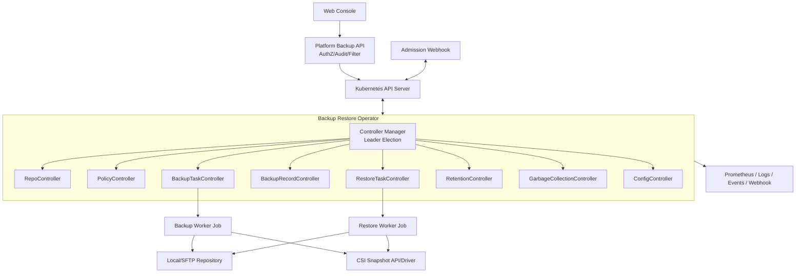
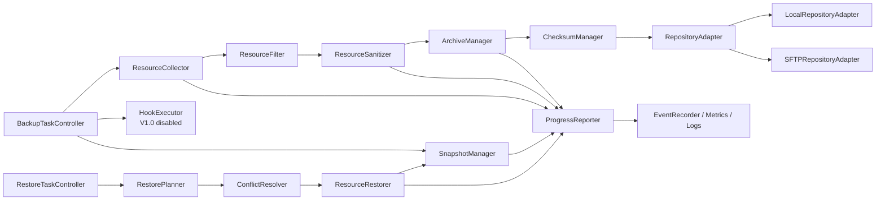
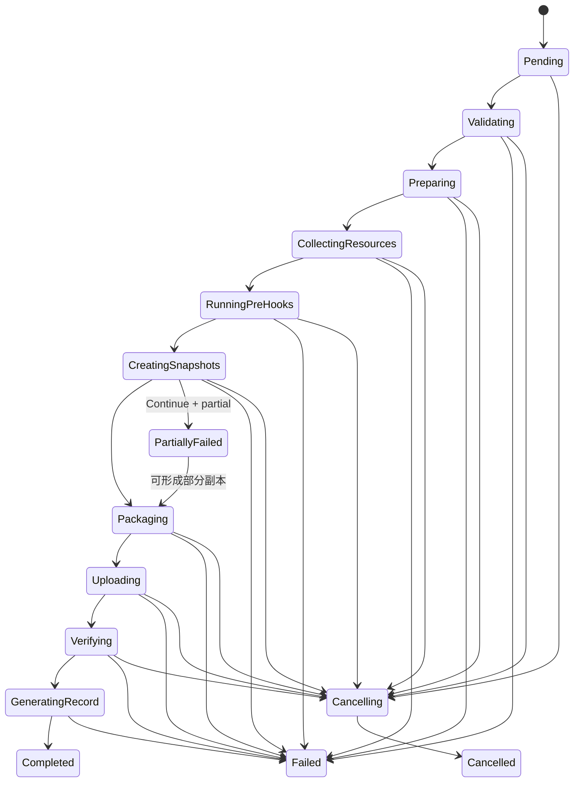
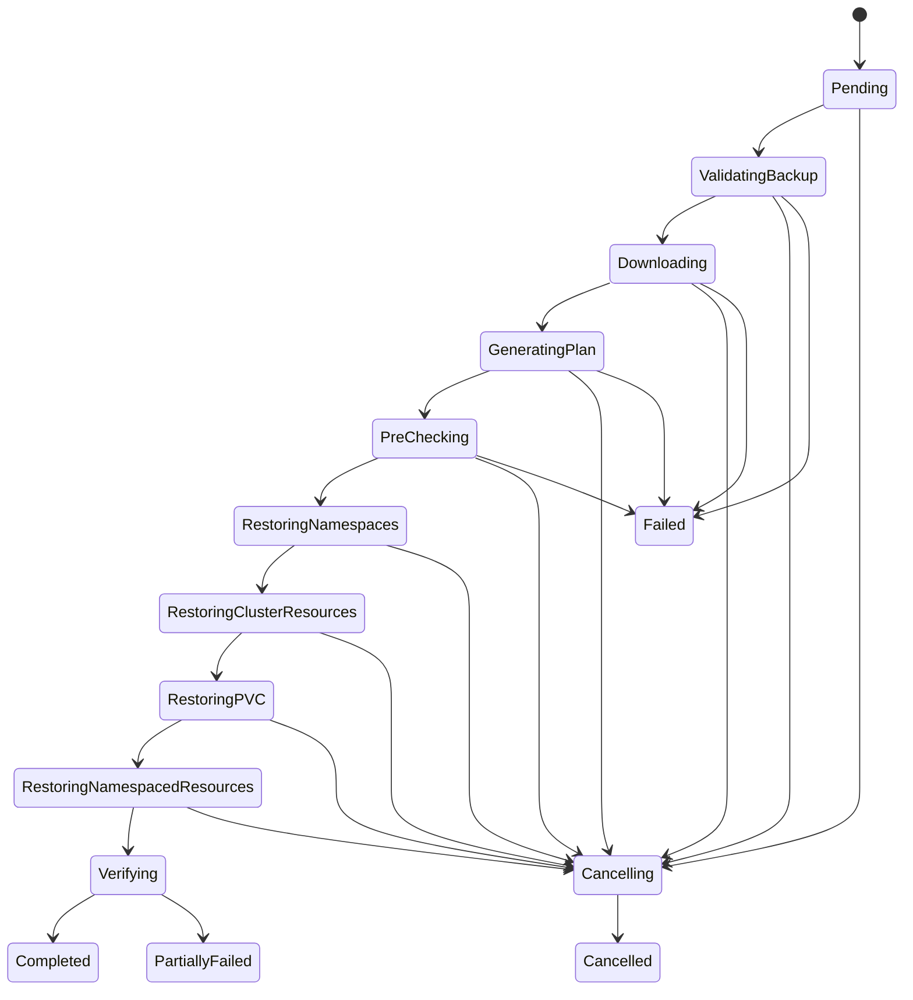

# 容器平台备份与恢复插件：Operator 技术架构

## 1. 架构目标与部署形态

Operator 采用 controller-runtime 风格的声明式控制器。API Server 中的 CRD/status 是控制平面事实源；Repo 与 CSI 快照是外部资产；短生命周期 Worker Job 执行高 I/O 归档/恢复。控制器副本可为 2–3，使用 Lease leader election；V1.0 单集群部署。

### 1.1 运行组件

| 组件 | 副本/持久性 | 职责 |
|---|---|---|
| controller-manager | 2，1 leader | watch/reconcile/status/finalizer/调度 |
| admission-webhook | 2，无状态 | 默认值、跨字段、引用与删除保护校验 |
| platform-backup-api | 平台既有 HA 规范 | 租户鉴权、行级过滤、幂等、审计、日志代理 |
| backup-worker Job | 每活动 Task 0/1；可重建 | discovery/list、sanitize、snapshot、package/upload/verify |
| restore-worker Job | 每活动 Task 0/1；可重建 | download、plan、apply、verify；控制器也可直接 apply 小规模任务 |
| workspace PVC/emptyDir | 每 Job | staging；不作为副本事实源；Job 重建可重新生成 |

Job 名称由 Task UID 确定，重复创建返回同一对象。Worker 通过最小权限 ServiceAccount，持续写 heartbeat/checkpoint（由 controller sidecar 或受限 status patch token）；不允许任意用户提交 Job 模板。

## 2. Controller 设计

| Controller | Watch | Reconcile 触发 | 主要动作/幂等键 | 失败重试/finalizer |
|---|---|---|---|---|
| RepoController | BackupRepository；关联 Secret metadata、PVC、Node；定时 tick | create/spec、Secret RV、PVC/Node 状态、健康周期、delete | 解析 adapter→能力/读写/rename/容量探测；`repoUID/checkUUID` 测试文件 | 网络指数退避；业务错误按 interval；repository-protection 检查引用/清 staging |
| PolicyController | BackupPolicy；Repo condition；BackupTask 反向索引；API discovery、VSC/SC/CSIDriver；时钟 requeue | spec/引用状态/选择预览/nextRun/Task 终态/delete | 规范化 `spec.selection`、刷新资源/PVC 预览、计算 due schedules、并发/补偿、创建 Task；`policyUID/generation/discoveryHash` 与 `policyUID/scheduledTimeUTC` | 429/5xx 重试；选择无效时不热循环；create conflict 后读回；policy-protection 不级联 |
| BackupTaskController | BackupTask；Worker Job/Pod；VolumeSnapshot/Content；Record | create、spec.cancel、Job/快照/status、timeout/delete | 驱动状态机、创建 Job/快照、checkpoint、生成 Record；`taskUID/step/objectUID` | 可重试错误按 policy；终态不重跑；execution finalizer 清 staging/安全取消 |
| BackupRecordController | BackupRecord；Repo/Snapshot 定时检查；RestoreTask | create、verify action、周期、Repo/快照变化、delete | 校验包/快照、availability、恢复统计、资产删除；`recordUID/verifyGeneration` | Repo 不可访问→RepoUnavailable；assets finalizer checkpoint |
| RestoreTaskController | RestoreTask；Worker Job/Pod；目标资源/PVC/VolumeSnapshot | create、cancel、资源状态、timeout/delete | 验证 Record、计划/预检、分组恢复、对象 checkpoint；`restoreUID/GVR/ns/name/action` | 对象型错误按 failurePolicy；execution finalizer 不回滚业务资源 |
| RetentionController | Policy、Record；周期 tick | Policy retention/Record expiry/Task terminal | 选保护后候选、发起 Record 删除 action；`policyUID/evaluationTimeBucket/recordUID` | Repo 故障不跳过 finalizer；失败下周期继续 |
| GarbageCollectionController | Task/Record 索引、Repo staging、内部 Job/临时 snapshot | 周期、终态、启动 | 清过期 staging/终态 Job/已孤儿临时资产，默认只报告未知资产 | 必须 ownership label+grace；未知不删；记录 GC report |
| ConfigController | BackupPluginConfig 单例 | create/spec/delete attempt | 校验、生成 immutable effective snapshot、广播配置 hash | Invalid 保留上个有效；删除恢复默认或拒绝 |

### 2.1 Watch 与索引

使用 field indexer：Policy by repo UID；Task by policy UID/phase/schedule key；Record by repo/policy/task UID/availability/expiry；Restore by record UID/phase；VolumeSnapshot by task/record UID label。Secret watch 只入队引用它的 Repo/Config，不缓存 data、不把 Secret 值写事件。

集群 discovery 没有稳定原生 watch，PolicyController 最长每 10 分钟刷新 `status.selectionPreview` 与 APIResource hash，策略 generation、CRD/StorageClass/VolumeSnapshotClass/CSIDriver 变化可触发提前刷新。

## 3. 内部组件

| 组件 | 输入/输出 | 关键规则 |
|---|---|---|
| ResourceCollector | `backupSpec.selection`→流式 unstructured objects | discovery+分页 List；RV 记录在 index；API QPS/burst 限流；单对象上限 |
| ResourceFilter | 对象流→included/excluded+reason | 授权交集；exclude 优先；GVR/namespace/label/system rules |
| ResourceSanitizer | included→可恢复 manifest+dependency index | 删除 runtime metadata/status/finalizer；owner 逻辑引用；Secret 不落日志 |
| SnapshotManager | PVC plan→VolumeSnapshot/Content result | 确定名称、readyToUse、driver/class/handle、超时、生命周期 |
| HookExecutor | Hook schema→结果 | V1.0 返回 Disabled；V1.1 命令白名单、解冻补偿、独立 RBAC |
| ArchiveManager | manifests/index→流式 tar/compress/encrypt | 稳定排序、路径逃逸防护、zip bomb 上限、workspace 检查 |
| ChecksumManager | package files→SHA-256 manifest | 对存储字节；常量时间比较；`.done` 最后 |
| RepositoryAdapter | CRUD/list/stat/commit | capability 接口；路径规范化；临时命名和提交协议 |
| LocalRepositoryAdapter | filesystem | no-follow symlink、openat/安全根、fsync、atomic rename、statfs |
| SFTPRepositoryAdapter | SSH/SFTP | known_hosts、连接池、timeout、statvfs、rename/.done、无凭据日志 |
| RestorePlanner | Record index+目标发现→DAG plan | 权限、版本、GVR、namespace、quota、CSI、webhook、冲突、依赖 |
| ConflictResolver | source/target/policy→action | Skip/Fail/Update/Recreate/Rename；不可变字段规则 |
| ResourceRestorer | plan→apply/checkpoint | 顺序组、SSA/Update/Create、UID 映射、owner 二次 patch |
| ProgressReporter | counters→Task status | 2s/1% 节流、终态立即；乐观并发重试 |
| EventRecorder | domain event→K8s Event/log/metric/notification | reason 枚举、低基数、敏感信息脱敏 |

## 4. 幂等、锁与故障恢复

### 4.1 幂等协议

1. Reconcile 先读取 spec/status/external facts，再计算单个下一动作；外部动作成功后写 checkpoint。
2. 如果“外部成功、status 写失败”，下次以确定名称/remote path/handle 查询并采纳，不重复创建。
3. package 文件先 staging，内容文件名固定，`.done` 为唯一 commit point；Record 名=`br-<backupID-short>`，Create conflict 后验证 backupID/taskUID。
4. 恢复对象 checkpoint 键包含 source digest 与目标 UID。若目标存在且 annotation `restore-task-uid/source-digest` 匹配，视为已执行；不匹配进入冲突决策。
5. status 使用 optimistic concurrency patch；条件基于 observedGeneration，禁止盲覆盖用户的 cancelRequested。

### 4.2 分布式锁与并发

- 全局单 leader 负责调度/Retention/GC；工作 Task 本身仍以 CR+Job 幂等，即便 leader 切换不会重复。
- `Lease backup-lock-<clusterHash>` 和 `restore-lock-<clusterHash>` 作为粗粒度可选锁；主要并发额度由 Task admission queue/status index 控制。Lease holder=`taskUID`、续租 15s、期限 45s；抢锁前必须确认旧 Task 非活动或 lease 过期且无 heartbeat。
- Repo 写锁 `repoUID/backupID` 只保护相同 backupID；Local RWO 另有 Repo 并发=1。SFTP 不用全局互斥，但受 maxConnections。
- 同策略 concurrency 与集群/Repo/快照并发三层均需满足；排队 Task 保持 Pending，status reason=`WaitingForConcurrencySlot`。

### 4.3 重试分类

| 类别 | 示例 | 策略 |
|---|---|---|
| Transient | 429、API 5xx、网络 reset、SFTP timeout、Leader 切换 | 指数退避+jitter，步骤最大次数；保留 checkpoint |
| DependencyUnavailable | Repo/CSI/Webhook 暂不可用 | 按 timeout 内重试，condition 指明依赖 |
| Validation | 越权、无效 GVR、类不匹配、包版本不支持 | 不自动重试，直接 Failed/Invalid |
| Conflict | 目标已存在/不可变字段 | 交给 conflictPolicy，不做网络重试 |
| DataIntegrity | checksum mismatch、路径逃逸、包 schema 损坏 | 不重试同一数据，Record Broken，安全告警 |

Task 级“重试”创建新 Task `trigger=Retry,parentTaskRef`，旧 Task 不复活；步骤级重试在同 Task `stepAttempts` 中进行。

### 4.4 崩溃与升级恢复

- Worker 每 15s heartbeat；连续 90s 无 heartbeat，Controller 查询 Job/Pod。Job 丢失且步骤可重建时重建同名 Job；正在 SFTP 字节流的步骤从 staging 校验后重传。
- 快照在 status 未写前创建成功时，通过 task UID 标签发现并采纳；同一 PVC 多个候选时保留确定名称对象，其余标孤儿待人工/GC。
- Operator 滚动升级使用 Lease；新 leader 等待 informer cache sync。checkpoint 携带 `schemaVersion`，新版本提供 decoder；不认识更高版本不执行并 condition=`UpgradeBlocked`。
- CRD 先扩展 schema/served version，再升级 controller，最后迁移 storage version；包 reader 向后兼容当前及前两个 major 策略见需求文档。

## 5. BackupTask 状态机

> `PartiallyFailed` 是终态，但当快照/资源出现可容忍失败时，内部先设置 `partial=true` 继续 Packaging；最终生成 Record 后进入 PartiallyFailed。图中回边表示内部标志，不表示终态再次运行。

| 状态 | 进入条件 | 动作/status | 成功 → | 失败 → | 重试/取消 |
|---|---|---|---|---|---|
| Pending | Task 创建 | 校验并发槽/锁；记录 queuedAt、reason | Validating | Failed（不可解析 spec） | 可重试 reconcile；可取消 |
| Validating | 获得执行槽 | Policy 来源解析一次并冻结 backupSpec；OneTime 来源直接校验 backupSpec；两者校验 Repo UID、spec hash、加密和 timeout | Preparing | Failed | 瞬态可重试；可取消 |
| Preparing | 校验通过 | 创建 workspace/Job、检查临时空间和 Repo 容量、生成 backupID/checkpoint | CollectingResources | Failed | 可重试；可取消 |
| CollectingResources | workspace ready | discovery/list/filter/sanitize/index；更新对象计数、RV、错误 | RunningPreHooks | Failed 或 partial flag | 分页可重试；可取消 |
| RunningPreHooks | 采集完成 | V1.0 确认 disabled；V1.1 执行 pre、记录 hooks results | CreatingSnapshots | Failed/partial | Hook 按定义；可取消且必须 post/unquiesce |
| CreatingSnapshots | PVC plan 完成 | 创建/采纳 VolumeSnapshot、等待 readyToUse；snapshot count/handle | Packaging | Failed 或 partial flag | API/CSI 瞬态；可取消，按生命周期清未提交快照 |
| Packaging | manifests/快照结果固定 | 写 metadata/index/snapshots/logs，tar→compress→encrypt→hash；ArchiveReady | Uploading | Failed | 可从输入重建；可取消并删 staging |
| Uploading | 本地包完整 | Repo staging 上传、bytes、重试、commit `.done`；Uploaded | Verifying | Failed | 网络可重试；可取消，删/留短期 staging |
| Verifying | `.done` 存在 | 从 Repo 重新读取 manifest/全量 hash、检查快照；IntegrityVerified | GeneratingRecord | Failed | Repo 瞬态可重试；数据不一致不可重试 |
| GeneratingRecord | 校验通过 | 确定名称创建 Record，确认其 UID/status accepted；recordRef | Completed/PartiallyFailed | Failed | create conflict 读回；过 commit 后不可取消，只能完成或失败待修复 |
| Completed | 完整成功 | completion、100%、Ready=True、释放锁/Job | 终态 | - | 不可重试/取消 |
| PartiallyFailed | 可容忍失败且副本完整 | 列出失败计数、Record completeness/snapshot 状态、释放资源 | 终态 | - | 可创建 Retry Task；不可取消 |
| Failed | 不可恢复错误/timeout | errorCode、Retryable condition、补偿 staging/临时快照、释放锁 | 终态 | - | 可重试则新 Task；不可取消 |
| Cancelling | cancelRequested/Replace/删除 | 停止新动作、终止 Job、解冻、终止上传、清 staging、处理未提交快照 | Cancelled | Failed（补偿失败，保留清单） | 补偿动作可重试；不可撤销取消 |
| Cancelled | 补偿完成 | completion、residual list、Ready=False/Cancelled | 终态 | - | 新 Task 才能重做 |

取消安全点：GeneratingRecord 已确认 `.done` 后不删除已提交副本，取消请求 condition reason=`TooLateToCancel`，控制器完成 Record；若用户随后不要副本，应走 Record 删除流程。timeout 先设置内部 cancel reason=`DeadlineExceeded`，补偿后终态 `Failed` 而非 `Cancelled`。

## 6. RestoreTask 状态机

| 状态 | 进入条件 | 动作/status | 成功 → | 失败 → | 重试/取消 |
|---|---|---|---|---|---|
| Pending | RestoreTask 创建 | 并发槽/锁、plan TTL 初检、queued reason | ValidatingBackup | Failed | 可重试 reconcile；可取消 |
| ValidatingBackup | 获槽 | Record name+UID、availability、format、checksum freshness、权限/同集群 | Downloading | Failed | RepoUnavailable 可等至 timeout；可取消 |
| Downloading | Record 可读 | 下载 metadata/index/所需归档，边下边校验/解密/解压安全检查 | GeneratingPlan | Failed | 网络可重试；完整性失败不重试；可取消 |
| GeneratingPlan | 索引就绪 | 过滤资源、namespace map、依赖 DAG、目标 discovery、冲突 action | PreChecking | Failed | 发现 API 瞬态可重试；可取消 |
| PreChecking | plan 生成 | SSAR、quota、GVR/schema、webhook、CRD conversion、SC/CSI、冲突/不可变字段；校验 planHash | RestoringNamespaces 或 Completed(dryRun) | Failed（blocking） | 瞬态可重试；可取消 |
| RestoringNamespaces | precheck passed | 创建/Skip/Fail Namespace，checkpoint/UID map | RestoringClusterResources | Failed/partial | 对象 API 瞬态；可取消，不回删已创建 NS |
| RestoringClusterResources | Namespace ready | CRD→等待 Established→cluster dependencies；checkpoint | RestoringPVC | Failed/partial | 对象级；可取消 |
| RestoringPVC | 依赖 ready | 创建目标 snapshot 引用/PVC，等待 Bound，记录 snapshot/PVC map | RestoringNamespacedResources | Failed/partial | CSI/API 瞬态；可取消，默认不删已绑定 PVC |
| RestoringNamespacedResources | PVC ready/未选择 | 依赖组顺序 apply、冲突决策、owner 二次 patch | Verifying | Failed/partial | 单对象重试；可取消 |
| Verifying | apply 完成 | GET 验证目标存在/digest、PVC Bound、Workload observed（不等待业务 Ready 默认） | Completed/PartiallyFailed | Failed | API 瞬态；此时取消仅停止验证 |
| Completed | 全部必需项成功 | 100%、审计报告、更新 Record restoreStats | 终态 | - | 不可取消 |
| PartiallyFailed | Continue 且部分对象失败 | 失败清单/残留资源/可重试建议、更新 Record 统计 | 终态 | - | `:retry` 重跑预检查并创建 trigger=Retry 新任务 |
| Failed | blocking/FailFast/timeout | errorCode、已创建/修改资源清单、无自动回滚 | 终态 | - | 可重试错误由 `:retry` 创建 parentTaskRef 新任务；原 Task 不复活 |
| Cancelling | cancelRequested | 停 Job/停止新 apply；完成当前 API 请求；列残留；释放锁 | Cancelled | Failed（清理内部临时物失败） | 补偿内部临时物可重试 |
| Cancelled | 已停止 | completion、residualResources、明确“业务资源未回滚” | 终态 | - | 另建恢复处理 |

## 7. 恢复计划与冲突实现

### 7.1 预检查项目

| 类别 | Blocking | Warning |
|---|---|---|
| Record | Broken/RepoUnavailable/format major 不支持/解密 key 不存在 | 校验超过周期、Operator minor 差异 |
| 权限 | 任一必需 create/get/patch/delete SSAR denied | 可选资源 denied 且用户排除 |
| Namespace | 目标未授权、名称无效、映射碰撞 | 已存在且策略 Skip/Overwrite |
| API/CRD | GVR 不存在、CRD conversion webhook 不可达 | 源/目标 preferred version 不同但可转换 |
| PVC | snapshot missing、driver 不可见、SC 不兼容、quota 不足 | WaitForFirstConsumer 需延迟绑定 |
| 冲突 | Fail 策略命中、Overwrite 不可变且不可重建 | Skip 差异、Rename 引用可能不完整 |
| Webhook | 明确拒绝 dry-run/依赖缺失 | Webhook 不支持 dry-run，运行时可能失败 |

计划输出稳定 hash 覆盖 Record UID/checksum、目标 cluster UID/discovery hash、namespace map、resource selection、PVC map、conflict policies、授权版本。提交时任一变化则 `BR-RESTORE-PLAN-STALE-003`，要求重跑。

### 7.2 资源 apply 策略

- Create：使用清洗后的 object，设置 restore task/source digest annotations。
- Skip：目标存在即不修改，记录 source/target digest diff。
- Overwrite：优先 server-side apply 到 `fieldManager=backup-restore-operator`；Secret data、Role rules 等敏感字段按完整替换策略；不可变字段需白名单 delete/recreate。PVC 默认永不 delete/recreate。
- Rename：生成目标名并对已知字段引用重写（envFrom、volume、serviceAccountName、ConfigMap/Secret refs、Ingress service、HPA scaleTargetRef）。无法证明安全的 CR 内自定义字符串引用不重写并警告，因此 CR 默认禁止 Rename。
- finalizer：源 finalizer 默认不恢复；若资源类型白名单确需 finalizer，由 post-restore action 在 owner/operator 已就绪后添加。

## 8. 安全与运行权限

Operator ClusterRole 按功能拆分并可关闭：core collector(read)、snapshot manager(snapshot CRUD + PV/PVC read)、restore writer(授权 GVR write)、secret reader(仅 `backup-system`，ClusterRoleBinding 无法按 namespace 时用 Role/RoleBinding)、hook executor(V1.0 不安装)。平台用户只绑定平台 API 权限，不绑定全局 CRD list/watch。

Worker Pod：`runAsNonRoot`、readOnlyRootFilesystem、drop ALL、seccomp RuntimeDefault；Local hostPath 可能需特定 UID/GID，不使用 privileged；workspace/Repo mount 受限。网络策略只允许 kube-apiserver、目标 SFTP、DNS、日志/指标端点。

## 9. 设计风险与替代

1. **用 Cluster-scoped CRD 承载租户对象**：原生 RBAC 无行级能力。替代是 Namespaced CRD，但与既定原则冲突；当前方案必须把平台 API 作为唯一租户入口并做定期越权审计。
2. **Local Repo 名称易误导**：PVC/hostPath 不等于灾备。UI 使用“本地仓库（单故障域）”并禁止将其标记为异地合规副本。
3. **Overwrite 过于宽泛**：V1.0 默认 Skip，将 Overwrite 限于非高危类型；不可变字段自动 delete/recreate 会造成业务中断，必须单独授权。
4. **SFTP 大包**：协议能力和吞吐弱于对象存储。V1.0 通过流式、连接池、staging/`.done` 保证正确性；高规模客户应提前进入 V2.0 对象存储。
5. **快照即备份的误解**：Retain 快照仍可能与生产存储同故障域；UI/报告区分“资源包所在故障域”和“快照所在故障域”。
