# 容器平台备份与恢复插件：业务流程设计

> 图中的“API”指平台 Backup API；所有写 CRD 请求均经过 Kubernetes RBAC 和 Admission Webhook。省略的失败分支遵循：业务校验立即失败、暂态错误指数退避、任务超时进入取消补偿、所有步骤写 status/condition/event。

## 1. 创建 Repo 与连通性检查

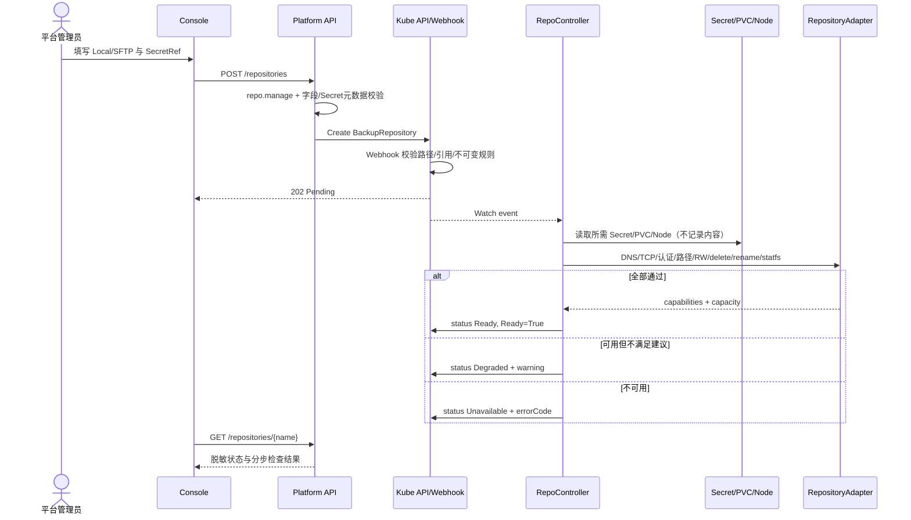

规则：测试文件位于 `.health/<repoUID>/<uuid>`，即使失败也在 finally 清理；测试成功不是永久保证，按 interval 复检。SFTP host key 不匹配直接 `BR-REPO-HOSTKEY-003`，不允许自动接受新 key。

## 2. 在 BackupPolicy 中配置范围并预览

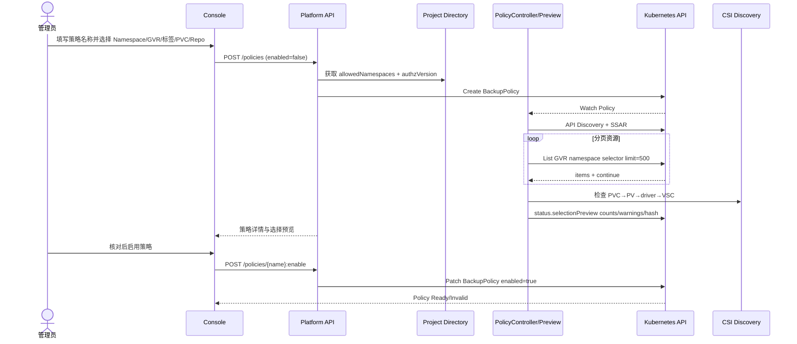

策略选择配置只有一个事实源：`BackupPolicy.spec.selection`。Controller 在策略 generation 变化时立即刷新预览，之后最长每 10 分钟刷新一次；预览不返回未授权对象名称。执行任务创建时会把当前选择冻结到 `BackupTask.spec.selectionSnapshot`。

## 3. 校验并启用 BackupPolicy

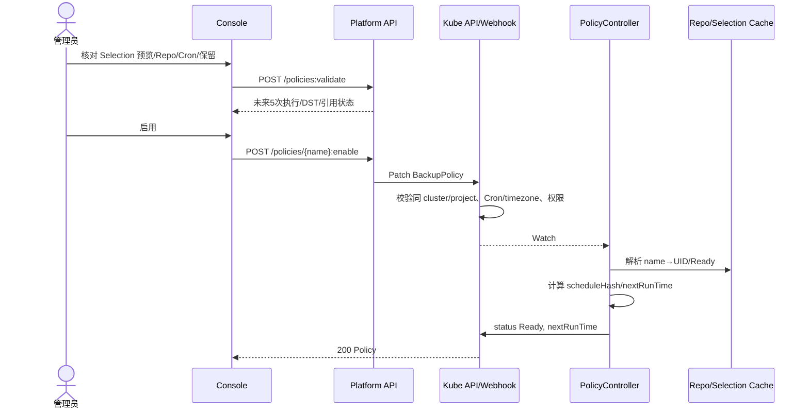

创建默认 enabled=false；启用不会立即备份。立即执行必须走单独 action。

## 4. 定时生成 BackupTask

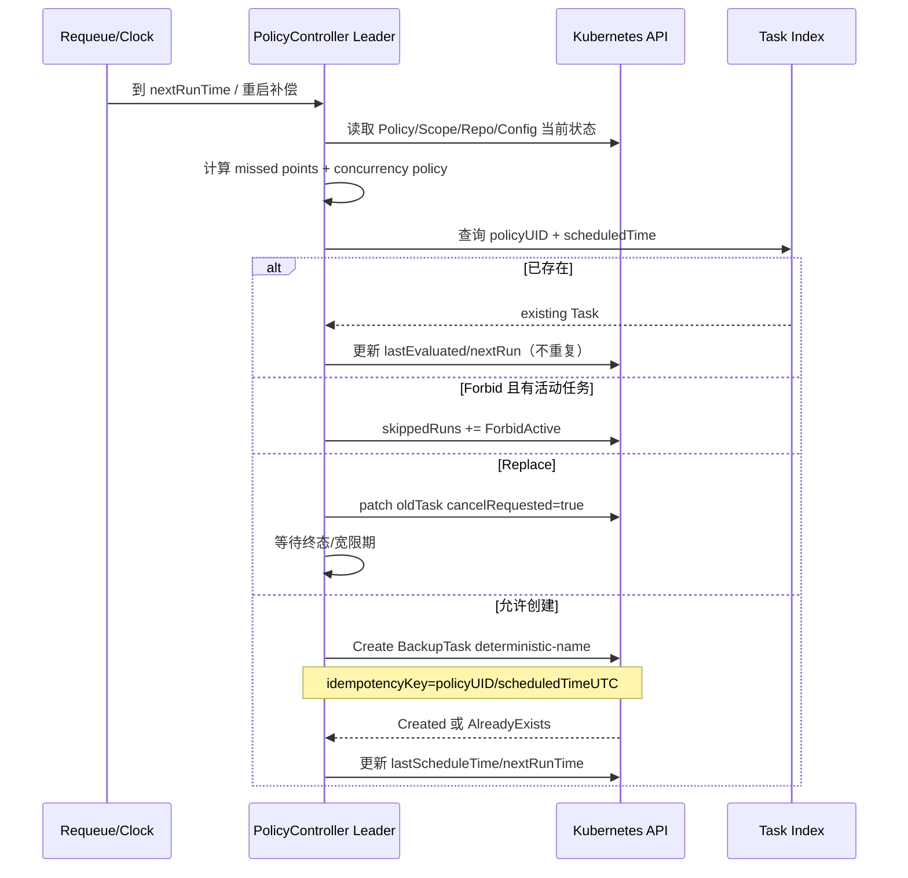

控制器停机后：Skip 不补；RunOnce 取 startingDeadline 内最近点；RunAll 从旧到新最多 10。Task spec 固化 Policy UID/generation、Selection、Repo UID/generation，策略后续修改不影响它。

## 5. 手动创建 BackupTask

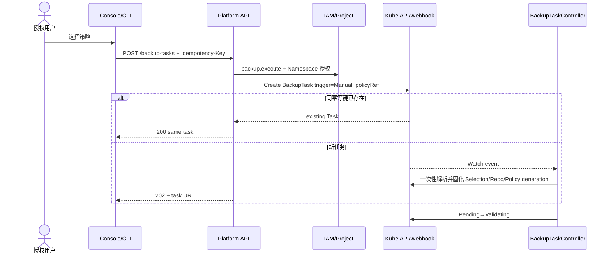

手动 Task 不修改/消费 Policy 下次执行时间。基于 Policy 立即执行时保留 policyRef，但 trigger=Manual。

## 6. 资源对象采集

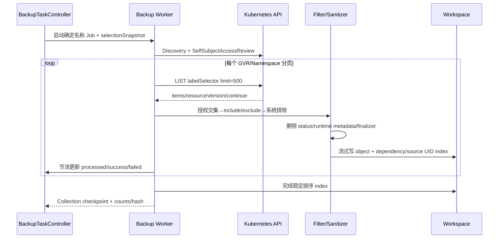

采集不是 API Server 一致性快照：每 GVR 记录 list resourceVersion 和采集窗口；metadata.json 明示 `consistency=BestEffort`。资源在采集期间变化产生 warning；V1.0 不通过 etcd snapshot 保证跨 GVR 原子一致性。

## 7. PVC 快照创建

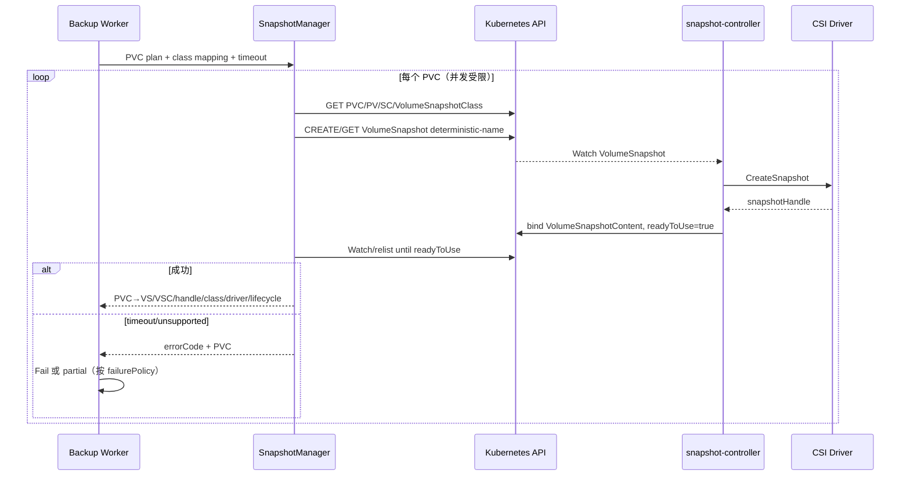

只读取 handle 存入加密包，不在普通 UI 展示。Task 删除不删除已提交 Record 的快照；未提交任务失败时，只有 Controller 创建且生命周期允许的快照才补偿删除。

## 8. 备份包归档和上传

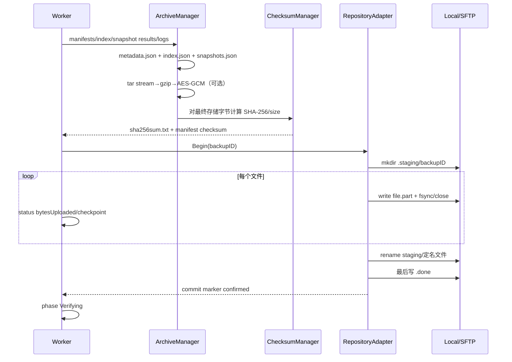

上传中无 `.done` 的目录永不被视为副本。SFTP rename 不支持时逐文件提交，仍以 `.done` 为可见性屏障。路径组件由 backupID 生成并防 `..`/symlink 逃逸。

## 9. 生成 BackupRecord

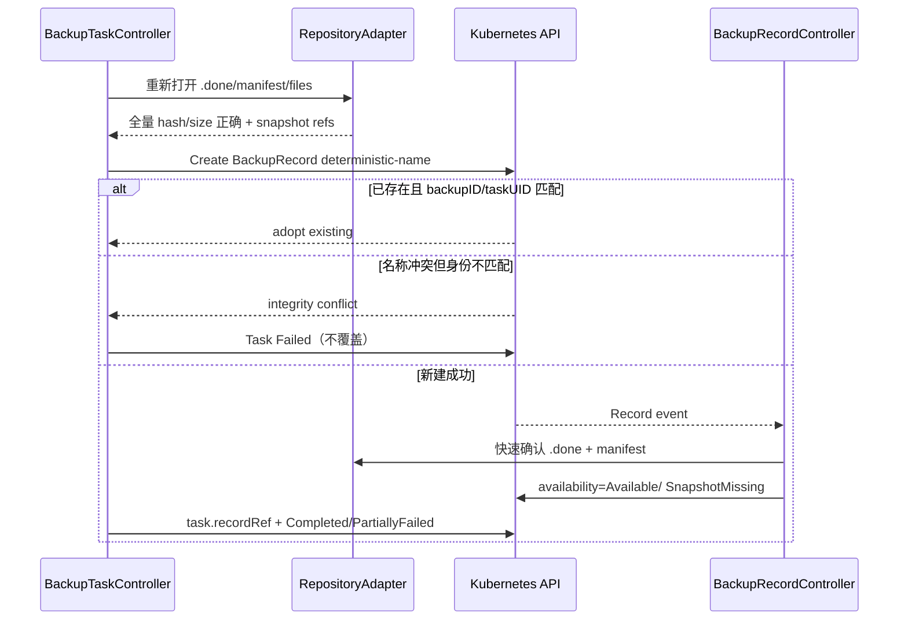

顺序不可倒置：commit → verify → Record create → Record accepted → Task terminal。若 Record 创建暂时失败，Task 留在 GeneratingRecord 重试，不重复上传。

## 10. 备份完整性校验

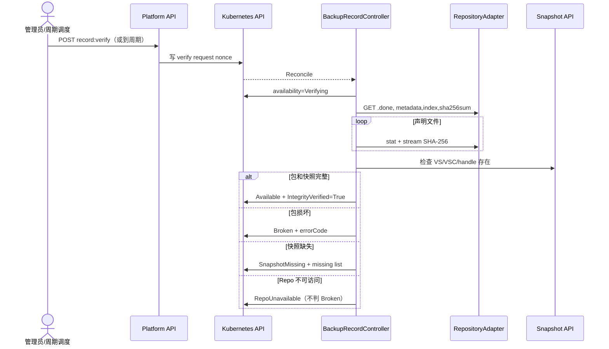

校验锁保证同 Record 仅一个；恢复开始时要求校验在全局 freshness 内，否则先同步快速校验。校验不自动“修复”包。

## 11. 创建 RestoreTask

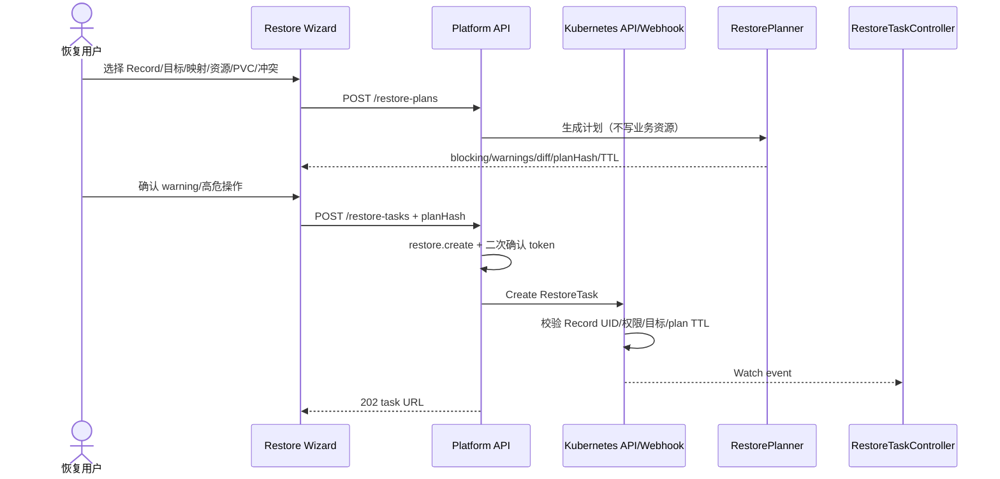

V1.0 targetClusterRef 必须等于 Record source cluster。任何 Namespace 授权、Record checksum、计划输入或 discovery hash 变化都会使 plan stale。

## 12. 恢复预检查

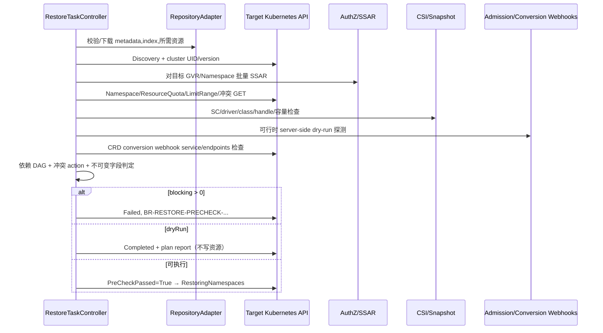

预检查通过不是永久保证，执行每个对象前仍处理竞态冲突。Webhook 不支持 dry-run 时标 Warning，不绕过 webhook。

## 13. PVC 恢复

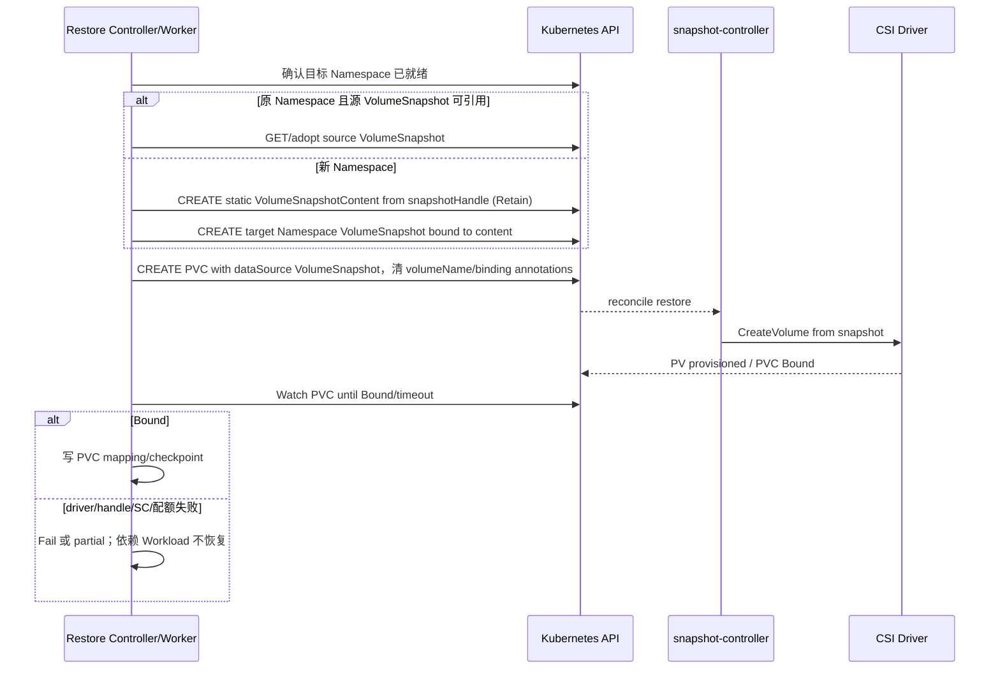

`WaitForFirstConsumer` 的 StorageClass 可能在无 Pod 时不绑定：V1.0 预检查提示，可先创建受控 placeholder consumer 或延迟到 Workload 组；默认采用延迟恢复 Workload 并等待调度，需存储厂商认证。

## 14. Kubernetes 资源恢复

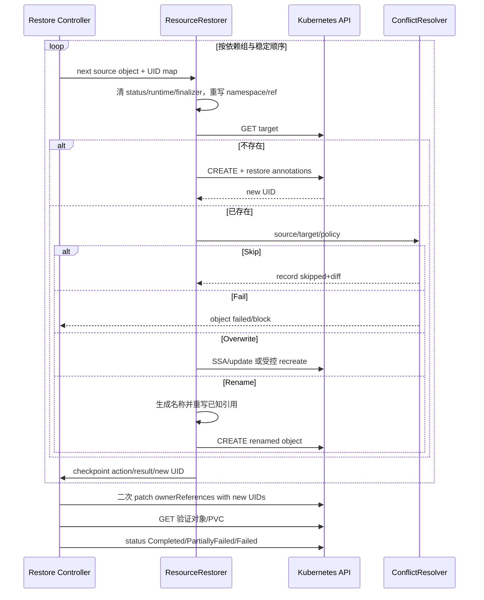

固定组序：Namespace、CRD、集群依赖、ServiceAccount、Secret、ConfigMap、RBAC、PVC、Service、Workload、Ingress、HPA/PDB/NetworkPolicy、CR。Service 默认不保留 clusterIP/NodePort；PVC 不恢复 PV 绑定；源 finalizer 默认不恢复。

## 15. 删除 BackupRecord

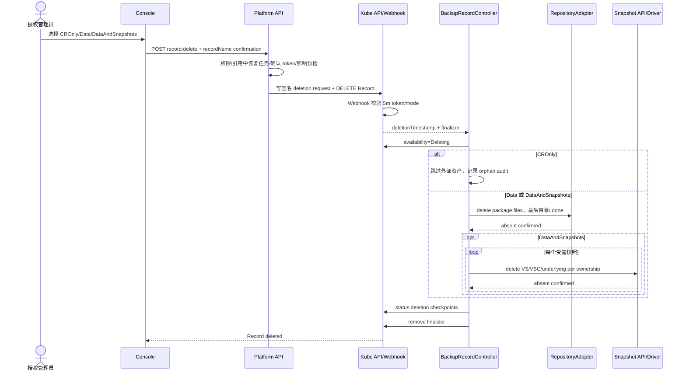

有活动 RestoreTask 引用时禁止删除。Repo 不可访问时保留 finalizer 并可重试；平台管理员可在风险审批后强制 abandon finalizer，此动作产生不可篡改审计和孤儿资产报告。

## 16. 保留策略与垃圾回收

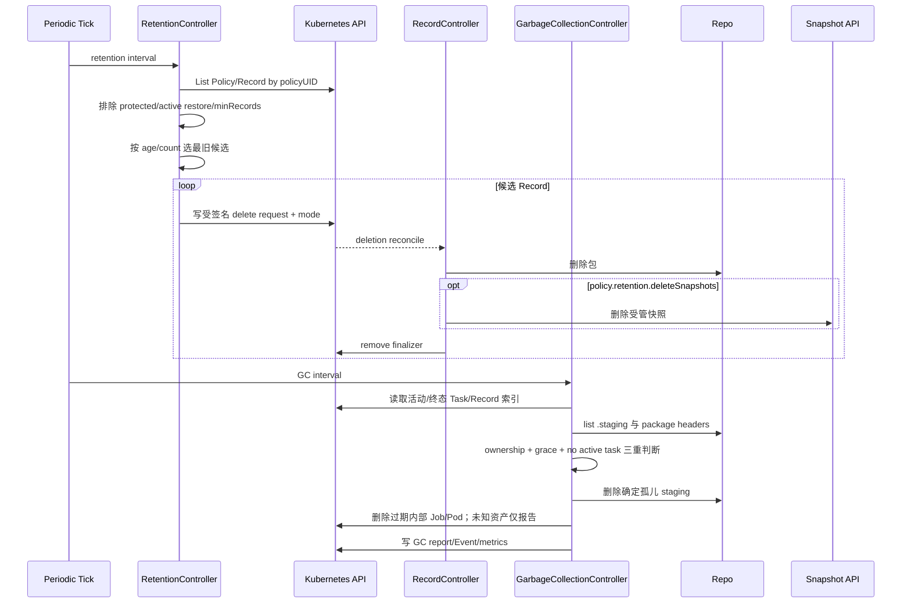

Retention 选择规则：保护标签/法律保留优先；至少保留 minRecords；到期或超过 maxRecords 的最旧记录成为候选。删除 Policy 不触发 Retention 级联；失去 Policy 的 Record 仍按自身 `expiresAt` 由全局 retention 处理。GC 永不根据“目录名看起来像备份”删除未知数据。

## 17. 异常与补偿总则

| 异常点 | 资产状态 | 补偿/恢复 |
|---|---|---|
| 采集中断 | 无 Repo commit；可能有 workspace | 重建 Job 后重新采集；GC 清 workspace |
| 部分快照创建后失败 | 未形成 Record 的受管快照 | Fail 时按 lifecycle 清理；无法清理列 orphan；Continue 可写 partial Record |
| 上传中断 | `.staging` 无 `.done` | timeout 内重试；终态后 grace 24h 由 GC 清理 |
| `.done` 已写、Record 未建 | 完整孤儿包 | Task 从 checkpoint 生成 Record；GC 识别 active Task，不清理 |
| checksum mismatch | Record 不创建或置 Broken | 禁止恢复；保留证据，人工排查存储/传输 |
| 恢复中取消 | 已创建资源可能存在 | 不自动回滚业务数据；输出 residual resources 和 action 日志 |
| Webhook 临时不可用 | 对象 apply 失败 | 瞬态重试至 timeout；Continue 可部分失败 |
| CRD conversion webhook 永久不可用 | 相关 CR 无法可靠转换 | 预检查 Blocking；先恢复/修复 webhook 依赖 |
| Repo 删除/凭据轮换 | Record 可能 RepoUnavailable | 新凭据重检；不把网络错误判为损坏 |

