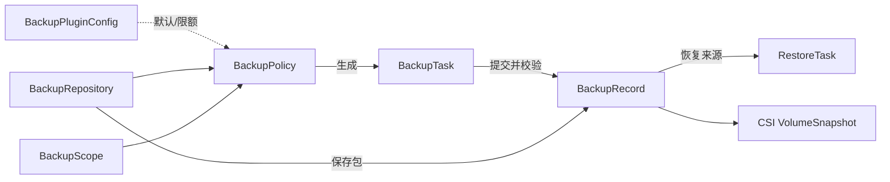

# 容器平台备份与恢复文档

本目录同时包含产品/架构设计基线与可运行 Operator 的研发交付说明。API Group 为 `protection.platform.io/v1alpha1`，核心 CRD 全部为 Cluster-scoped；业务对象仅保留 `clusterRef` 作为单集群路由与同集群引用字段。

当前仓库发行物是**单集群管理员/单租户 Operator**。集群管理员可通过 Kubernetes API/CRD 操作，普通用户不得直接 get/list/watch 或写 Cluster-scoped CRD。`BackupScope.includeNamespaces` 仅控制备份选择范围，不表示用户对 Namespace 拥有权限。面向普通用户的多租户能力不在当前 MVP：未来必须增加平台外部 ACL/API、对象可见性过滤、审计，并在预览、备份和恢复执行时复验 Namespace 权限。

## 文档导航

| 文档 | 内容 |
|---|---|
| [01-需求规格说明书.md](./01-需求规格说明书.md) | 场景、角色权限、功能/NFR、版本规划 |
| [02-产品功能与页面设计.md](./02-产品功能与页面设计.md) | 菜单、页面、向导、字段与交互 |
| [03-CRD对象设计.md](./03-CRD对象设计.md) | 7 个 CRD、PVC、关系和示例 |
| [04-Operator技术架构.md](./04-Operator技术架构.md) | Controller、组件、幂等、锁和状态机 |
| [05-备份恢复流程设计.md](./05-备份恢复流程设计.md) | 16 个 Mermaid 时序流程 |
| [06-API设计.md](./06-API设计.md) | 未来管理员 REST API 草案与错误模型；当前仓库未实现独立 API Server |
| [07-验收测试用例.md](./07-验收测试用例.md) | Given/When/Then 验收基线 |
| [08-需求追踪矩阵.md](./08-需求追踪矩阵.md) | 需求到 CRD/Controller/API/页面/测试追踪 |
| [09-Operator开发实现.md](./09-Operator开发实现.md) | 实际代码、关键决策和设计偏差 |
| [10-部署与操作手册.md](./10-部署与操作手册.md) | 构建、安装、凭据、操作、删除和排障 |
| [11-开发测试报告.md](./11-开发测试报告.md) | 已执行证据、环境限制和发布门禁 |

## 核心关系

Policy/Task/RestoreTask 删除不会级联删除 Record；业务 Namespace 生命周期也不会影响 Record。Record 删除必须明确 `RecordOnly`、`RepositoryData` 或 `RepositoryDataAndSnapshots` 并二次确认。

## MVP 边界

V1.0 实现 Local/SFTP、Cluster/Namespace 资源备份、CSI CrashConsistent 快照、Cron/手动任务、独立 Record、同集群恢复、基础加密校验与可观测性。不支持多租户/项目级权限、普通用户代理 API、跨集群快照、文件级数据备份、S3/OBS/MinIO、AppConsistent Hook、Repo 复制迁移和多集群灾备编排。

安全与兼容风险：Operator ServiceAccount 具有集群级高权限，绝不能允许普通用户模拟；Kubernetes RBAC 无法对 Cluster-scoped CR 按 spec/label 做对象级行授权。若从包含旧身份字段的早期 `v1alpha1` 升级，应先导出对象并显式应用新 CRD；Helm 不会在 `helm upgrade` 时自动更新 `crds/`。旧备份包不得为清理元数据而原地改写，否则会破坏 checksum。

## 待确认事项

1. 企业正式 Go module、镜像仓库和 API domain 是否继续使用当前值。
2. 首批生产 Kubernetes/CSI 厂商兼容矩阵。
3. 未来多租户平台外部 ACL/API 的对象授权模型、Namespace 执行时复验和撤权语义；不得以 Scope 的 Namespace 选择替代授权。
4. Worker Job 化进入 V1.0 GA 还是 V1.1。
5. Local Repo 是否只作为开发/应急能力，生产是否强制远端仓库。
